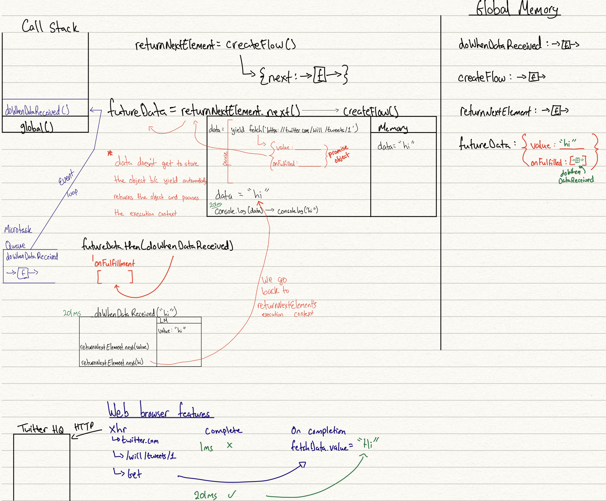
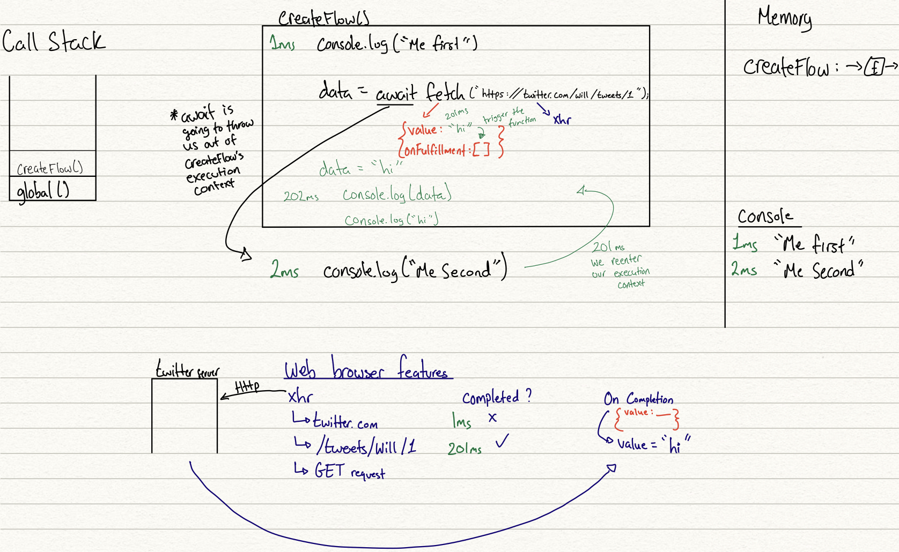

<div align="center"> <h1>Understanding JavaScript</h1></div>

## 1. Execution Context - Thread of Execution - Global Memory - Call Stack

There are two halves to the process of executing code

1) The ability to walk through the code line-by-line → known as the thread of execution <br> All that is, is the ability to take line one → execute it, line two → execute it, and so on. <br> It's threading its way down our code (top → bottom) <br>
2) Simultaneously, the other part that's required to run our code is a place to store the bits of data that we announce as we go through our codes global execution context, which is the global memory.

So to reiterate, when Javascript code is run, the thread of execution reads each line of code. Line-by-line and when it reads each line it also saves everything in global memory:

  - function definitions
  - variables
  - etc...

And when it reads a line where a function is invoked, Javascript creates a `local execution` context that keeps track of the variables/constants used inside the function block known as `local memory`.

<p align="center">

<image src="/Images/executioncontextex.png">

</p>

> When we execute `multiplyByTwo(10)` Javascript creates a execution context
> Inside we run the code of a function and keep track of the variables inside the function definition using Local Memory
>
> Engine: Line one. There’s a variable → Let’s store it in the Global Memory.
>
> Engine: Line two. I see a function declaration → Let’s store that in the Global Memory too!
>
> Engine: Line 3. Declare a variable and the output is the return value of the execution of multiplyByTwo(num)
>
> Engine: Line 4. Declare a variable and the output is the return value of the execution of multiplyByTwo(10)
>
> Engine: Looks like I’m done.

Multiple functions can be invoked, so how does Javascript keep track?

Using a call stack.

Always in the call stack is global, so when there are no more functions left on the call stack, it returns back to global.

In the example above, our call stack would push `multiplyBy2(num)` → create an execution context (return result) → pop `multiplyBy2(num)` off the stack 

Then push `multiplyBy2(10)` onto the call stack → create an execution context (return result) → pop `multiplyBy2(10)` off the stack and return to global

## 2. Variables

ES6 introduced 2 additional keywords to declare a variable:

- let
- const

> `const` variables cannot be reassigned, while `let` and `var` can
> 
> `let` provides a solution to the scoping issue seen with `var`
> 
> Both `let` and `const` are block scoped, whereas `var`s scope is confined to the function in which it's defined
> 
> **And** unlike `var`, `let` and `const` statements are not hoisted to the top of their enclosing scope

### 2.1 block scoping with let

An example using `var`:

<p align="center">

<image src="/Images/blockscope.png">

</p>

You'd expect the `console.log(i)` in `start` to throw a reference error, but `var` scope is confined to `start()`

This behavior in `start_` is more expected, `i` is confined to the for-block. 
So attempting to see its value outside will throw a reference error

`let` is great for using inside of blocks - if we were to swap `let` with `var` the error would go away
Because `i` becomes accessible outside the scope, and we can display the current value of i.

> Referencing block-scoped identifiers before they are defined will produce a `ReferenceError`

## 3. Destructuring

Destructuring: decomposing a structure into its individual parts

The purpose of destructuring as a feature is to assign individual pats from some larger structure. Assign to individual variables, assign to individual properties from some larger object

### 3.1 Array Destructuring

```js
let tmp = getSomeRecords();

let first = tmp[0];
let second = tmp[1];

let firstName = first.name
let firstEmail = first.email !== undefined ? first.email : "nobody@none.tld";

let seconName = second.name
let secondEmail = second.email !== undefined ? second.email : "nobody@none.tld";
```

This example of highly imperative code can be done with this declarative destructuring syntax like this:

```js
let [
  {
    name: firtName,
    email: firstEmail = "nobody@none.tld"
  },
  {
    name: secondName,
    email: secondEmail = "nobody@none.tld"
  }
] = getSomeRecords();
```

On the left hand side of our `=` we have what looks like an array and what looks inside of that array are objects...
**But** this is not an array of objects... because its on the left hand side of an `=`, it's not a value at all <br> It's actually a **pattern**

It's a syntax that is describing the value that is expected from the right-hand side, which is where we call the `getSomeRecords` Api.

And the purpose of that pattern is not just for code-documentation or describing the data, but the real purpose for describing it is so that we assign off those individal values as we need them

For example `name: firtName,` → this is essentially saying, go make me a variable called firstName, that has the value that is in this particular location of the data structure, which is the name property of the first object in an array

It describes to JavaScript declaratively how it should break down that structure and make individual assignments for you.
And here `email: firstEmail = "nobody@none.tld"` we include an `=` clause there, and its the default value expression that says if there's not an email property present go ahead and use this backup value to assign to firstEmail

So with destructuring, any place where you would be trying to break down and assign off pieces from some larger data sttructure, a destructuing pattern can do that <br>
And it doesn't always have to be a crazy JSON object, it can be an API that returns a 2 element array and you only care about element at position 1 in the array... <br>
Where you would normally do is assign the array to a temporary variable then access temporary variable, position one. This is the imperative approach

With the destructuring approach, I want to give the array this destructuring pattern for this assignment and then I'm going to leave the first element entry blank and only name the second entry, because that's the only one that I want to sign off

The other take away is that destructuring (the pattern) does not have to account for the entirety of the value. <br>
The pattern only has to account for the part of the value that you care about at that moment... It does not have to fully describe it. <br>
And there could be a lot of properties on those object but we're saying we only care about the name and email properties. <br>
So this pattern is describing potentially, either the entire structure or just a subset of it, of the necessary structural parts to get at the things that we care about

The other take away is that essentially this code in its declarative nature, is self-documentating, because in a sense we're documenting with syntax what we're expecting the value returned from the API call.
It would be duplicative if we were to put a JS comment unless there was a significant amount of other information that we weren't putting in the desctruting patterns

```js
// old way of destructuring (imperative approach)
function data(){
  return [1,2,3,4,5];
}

var tmp = data();
var first = tmp[0];
var second = tmp[1] !== undefined ? tmp[1] : 10;
var third = tmp[2];
var fourth = tmp.slice(3);

// ***************************************************************************************************

// new way of desctructuring
function data2(){
  return [1,,3,4]
}

var [
  first,
  second = 10,
  third,
  ...fourth // we can use the spread operator to gather everything else up in an array called fourth
] = data2(); // the square bracket is our pattern b/c it's on the left hand side of the equal sign
```

The spread operator **must be at the end** of the pattern, you cannot place it in the middle

Another thing to note is destructuing is about the assignment not the declaration
We could have done:
```js
function data2(){
  return [1,2,3,4]
}

var first, second, third, fourth

[
  first,
  second,
  third,
  ...fourth 
] = data2();
```

If we have nested arrays that we want to destructure

```js
function data(){
  return [1,[2,3],4]
}

var [
  first,
  [
    second,
    third
  ],
  fourth
] = data();

or 

function data(){
  return [1,undefined,4]
}

var [
  first,
  [
    second,
    third
  ] = [],
  fourth
] = data();
```

### 3.2 Object Destructuring

In many ways it's similar to array destructuring:

```js
function data(){
  return {a: 1, b: 2, c:3}
}

var tmp = data();
var first = tmp.a;
var second = tmp.b;
var third = tmp.c;

function data2(){
  return {a: 1, b: 2, c:3}
}

var {
  a: first,
  b: second,
  c: third
  // since position doesn't matter with objects we have to tell it what's the source to be assigned
  // And the way to tell it, is to give it a property name - in this case the property name that we're getting it from is "a"
  // We want "a" to be assigned to a variable called first
  // So the syntax is: source : target 
} = data2();
```

If you want to collect any unaccountated properites you can do:

```js
function data2(){
  return {a: 1, b: 2, c:3, d:4}
}

var {
  a: first = 42,  // set a default if a is undefined
  b: second,
  ...third // c and d are in this third object now
} = data2();

// different way of writing our destructured object
var first, second;
({
  b: second,
  a: first
} = data());
```

How to deal with sub-objects:

```js
function data(){
  return {
    a: 1,
    b: {
      c: 3,
      d: 4
    }
  }
}

var tmp = data() || {}
var a = tmp.a;
var b = tmp.b;
var c = b.c;
var d = b.d;

// or destructure way

var {
  a,
  b: {
    c,
    d
  } = {} // if the sub-object doesnt exist, the default value is empty object
} = data() || {}
```

Paramter Objects

```js
function data(tmp = {}){
  var {
    a,
    b
  } = tmp;
}

// Better way is to:

function data({
  a,
  b
} = {}) {
  // .. 
}
```

### 3.3 Further Destructuring

destructuring: named arguments:

```js
// while JS does not support this 
function lookupRecord(store="person-records", id = -1){
  // ...
}

// we can do it this way
function lookupRecord({
  store = "person-records",
  id = -1
}) {
  // ...
}

lookupRecord({ id: 42});
```

Destructuring and restructuring

You have an object that represents some defaults (`var defaults`) and I store these defaults in an object b/c I want to mix them with some settings whenever I make an ajax call
```js
var defaults = {
  url: "http://some.base.url/api",
  method: "post",
  headers: [
    "Content-Type: text/plain"
  ]
}

console.log(defaults);

var settings = {
  url: "http://some.other.url",
  data: 42,
  callback: function(resp) { // ... // }
}

ajax(_.extend({}, defaults,settings));
```
So essentially there are two separate objects that can be mixed together at the call site for the AJAX Call <br>
At the call site we're using the underscore library's `extend` method to take several objects(in this case default and settings) and it first copies defaults into the object and then it overrides anything that comes through with the settings into the object.

A different approach to achieve the same thing:

```js
function ajaxOptions({
  url = "http://some.base.url/api";
  method = "post",
  data,
  callback,
  headers: {
    headers0 = "Content-Type: text/plain",
    ...otherHeaders
   } = {}
} = {}) {
  return {
    url, method, data, callback,
    headers: {
      headers0,
      ...otherHeaders
    }
  }
}
```

Basically what's happening is you pass in an object of your settings and I'm using the default algorithm to mix in any defaults where your settings are missing, at any level of the declarative structure
And what I end up with then is down at the bottom:
```
{
  url, method, data, callback,
  headers: {
    headers0,
    ...otherHeaders
  }
}
```
I have whole set of individual variables that I need to restructure back into the new merged object <br>
So destructuring happens at the top and at the bottom we recreate the object structure with all the new mixed in values

In other words, in any place where I'm going to or would be inclined to use something like `_.extend` I just defined a function for that specific purpose and I give it a good semantic name like: `ajaxOptions` and instead of maintaining my defaults for my AJAX in a default AJAX options object, I just have those defaults inside of the function in its destructuring parameter signature

## 4. Functions

### 4.1 Function Declarations, Expressions and Named Function Expressions

There are multiple ways to create functions in JavaScript and each method has its pros and cons

```js
function teacher() { / ... / }
// function declaration

const nameImprover = function(name, adj){
  return 'Col' + name + ' Mc' + adji + ' pants'
}
// This is an anonymous function expression

const nameImprover = function nameImprover(name, adj){
  return 'Col' + name + ' Mc' + adji + ' pants'
}
// named function expression

const myTeacher = function anotherTeacher(){
  console.log(anotherTeacher) // Reference Error
  // will throw display a ReferenceError, because there is no `anotherTeacher()` in global scope 
  // therefore global scope never heard of this function
}
```

**One of the key differences** between *function declarations* and *function expressions* is:

- that function declarations attach their name to the enclosing scope
- whereas function expressions put their identifier into their own scope.

A named function expression is ... a function expression thats been given a name.

```js
var clickHandler = function() {
  // function expression...
}

var keyHandler = function keyHandler(){
  // named function expression...
}
```

`clickHandler()` is a function expression:
- why is it a function expression?
  - because its not a function declaration...
    - How do we know if somethings a function declaration? 
      - if the word function is literally the first thing in the statement

So if `function` is not the first thing in the statement, if there's a variable or an operator or parenthesis, then it's not a declaration... **it is an expression** <br>
**BUT also,** we see no name, so it's an **anonymous** function expression

whereas `keyHandler()` is a named function expression.

Setting aside the syntax differences between anonymous function expressions and named function expressions <br> 
Anonymous function expressions are vastly more common/popular, but they make debugging code much harder <br>
Using **named function expressions** should be used more often because:

1. The name produces or creates a reliable self reference to the function from inside of itself 
   - that's useful if the function is recursive
   - if the function is an event handler and it needs to reference itself to **unbind itself**
   - its useful if you need to access any properties on that function object (i.e name, length, etc)
   - Any time you need a self reference to the function, the only right answer to that question is, it needs to have a name.
2. More debuggable stack traces, in the stack traces you'll get `Anonymous Function` in the stack traces <br> but if you used a named function expression then you know exactly where your code is failing, or whats getting called or not getting called
3. More self-documenting code - we have to read the function body of an anonymous function and where its being called to **infer** what that function is doing ... Where as with function declarations the purpose of the function is in the name

### 4.2 IIFEs (another form of anonymous function expressions)

Immediatelly Invoked Function Expressions

1. Immediately Invoked - runs immediately
2. Function - a typical anonymous javascript function
3. Expression - a javascript expression is a piece of code that simply evaluates to a value

```js
var teacher = 'Will'

(function anotherTeacher(){
  var teacher = 'Lenny'
  console.log(teacher)
})();

console.log(teacher)
```

You'll notice that from the beginning of the declaration of `anotherTeacher()` there's a wrapping set of parenthesis around that function → That's what makes it a function expression, instead of a function declaration.

And then at the end of the function definition, you can see an extra set of parenthesis, which means it's getting invoked. Hence the 'immediately ivoked' part of the name

The main result of an IIFE is we get a new block of scope, there's a block of scope inside of that function `anotherTeacher()`

> One of the well-known uses of IIFEs is avoiding global scope pollution
> Local variables declared using `var` keyword are scoped to the closest containing function
> And if there is no fnuction that exists, the variables will be global and would pollute the global scope
> To avoid this we simply wrap the `var` variables in an IIFE such that they are scoped within and isolated from global 

**However,** after the introduction `let` and `const`, this use-case lost its popularity

**Another usecase is Closures and Private Data**, IIFEs enable you to create closures that can maintain private Data

```js
const uniqueId = (function(){
  let count = 0;
  return function(){
    ++count;
    return `id_${count}`;
  };
})();

console.log(uniqueId()); // "id_1"
console.log(uniqueId()); // "id_2"
console.log(uniqueId()); // "id_3"
```

> By wrapping a local variable and have it accessed by a function that will be returned by the IIFE. 
> This implementation provides a closure that enables the function to access the local variable even when that function function is executed **outside** of the IIFE's lexical scope
> And the `count` variable cannot be accessed or modified from outside the scope making it **truly** private.
> The only way to access the variable is through the function being returned by the IIFE

### 4.3 Arrow functions (another form of anonymous function expressions)

An arrow function expression is a compact alternative to a traditional expression, **but** is limited and can't be used in all situations.

```js
// Traditional Function
function (a){
  return a + 100;
}

// Arrow Function Break Down

// 1. Remove the word "function" and place arrow between the argument and opening body bracket
(a) => {
  return a + 100;
}

// 2. Remove the body brackets and word "return" -- the return is implied.
(a) => a + 100;

// 3. Remove the argument parentheses
a => a + 100;

// ************************************************************************************************ \\

function myFunc() {
  this.myVar = 0
  var that = this; // that = this trick
  setTimeout(
    function () { // A new *this* is created in this function scope
      that.myVar++;
      console.log(that.myVar) // 1
      
      console.log(this.myVar) // undefined 
    }, 0);
}

function myFunc() {
  this.myVar = 0;
  setTimeout(
    () => { // this is taken from surrounding, meaning myFunc here
      this.myVar++;
      console.log(this.myVar) // 1
    }, 0);
}
```

Syntax differences:
We don't have to wrap our parameters in parenthesis if there's only 1 parameters
If the function body is only 1 line - we don't need to wrap it in curly braces

It binds the context, and the context is the value that 'this' has ... to its parent context

All functions have a keyword 'this' that gets bound at call time...

Arrow functions do not have their own value for `this`
They inherit, they reach up to the parent scope and grab that value of `this` in that parent scope

And this functionality of arrow functions replaces the need to use `.bind()` or `var that = this → that = randomObj`

Another thing is that arrow functions don't have its own value for the arguments keyword
So the arguments keyword, at call time, gets bound to all the arguments that are being passed to the function

The arguments keyword is the same as the arguments that are being passed, except it's an object-like-array
That comes for free in all of our regular functions in JS, but not arrow functions

Automatic returns in arrow functions can be tricky, its always better to explicitly write a return statement inside your arrow function


```js
var ids = people.map(person => person.id);

var ids = people.map(function getId(person){
  return person.id;
})
```

The arrow functions purpose (while obvious) the reader still has to **infer** the purpose of the function
Whereas the second one we know it gets an ID, we could even call it `getPersonID()` to be more descriptive

**You should definitely not be using arrow functions for general replacements for all other functions** !

One of the main reasons you should use arrow functions comes from it's **lexical `this` capabilities**

Another is: **Promise-chains**

```js
getPerson()
.then(person => getData(person.id))
.then(renderData)

getPerson()
.then(function getDataFrom(person){
  return getData(person.id)
})
.then(renderData)
```

And while you can do Named (Arrow) Function Expressions...
Its more characters to define the function as an arrow function then it is to make it a function declaration
```js
var getID = person => person.id;
var ids = people.map(getID)

// ****************************

var getDataFrom = person => getData(person.id);
getPerson()
.then(getDataFrom)
.then(renderData);
```

Personally I believe this is the heirarchy of function types that should be used:

1. Function Declarations
2. Named Function Expressions
3. Anonymous Function Expressions

### Arrow-functions and `this`

<p align="center">

<image src="/Images/js_snippet13.png">

</p>

Here `this` is correctly pointing to the workshop object
**How is this not implicit binding???????**
The behavior is actually called "lexical `this` behavior

Lexical `this`: many people think that an arrow function is essentially a hardbound function to the parent's `this` ... this is not accurate
The proper way to think of what an arrow function is... **an arrow function does not define the `this` keyword at all**
there is no such thing as a `this` keyword in an arrow function, which means **IF** you put a `this` keyword inside an arrow function it's going to behave **like any other variable**
Which means it's going to lexically resolve to some enclosing scope - that does define a `this` keyword

In the example above, when we say `this.` ... there is no `this` in that arrow function **NO MATTER HOW IT GETS INVOKED**
So we lexically go up one level of scope which is, the `ask()` function...
`this` goes out from the `callback` function (the  arrow function) that scope → to the enclosing scope, which is??? `ask()`
AND `ask()`'s definition of the `this` keyword is **determined by HOW IT IS INVOKED**...
`workshop.ask("Is this lexical `this`?");` ... `ask()` is being invoked by the workshop object... so `this` inside the arrow function determines what is pointing to by how `ask()` gets invoked.

So it resolves lexically, meaning if you had 5 nested arrow function it will go up 5 levels and keeps on going until it finds a function that defines a `this` keyword and whatever the `this` keyword points at for that function, that's what it uses.

The **spec sheet** for Arrow function says:

1. An arrow function does not defined local bindings for `arguments`, `super`, `this` or `new.target`. **Any reference to `arguments`, `super`, `this` or `new.target` within an arrow function must resolve to a binding in a lexically enclosing environment**
2. If you call `new` on an arrow function, you get an exception ... an error


<p align="center">

<image src="/Images/js_snippet14.png">

</p>

We tend to think that `{}` curly braces are scopes, theyre blocks, theyre function bodies ... they must be scopes!
**No!** 
In this example, when `this` goes up one level to resolve what `this` is pointing to... it won't point to the workshop object! just because it has curly braces doesn't mean its a scope! **Objects are not scopes!!!**, **Object properties aren't scoped, properties arent lexical identifiers**

**You have to think about an arrow function as not having a `this` and resolving it lexically!** 
So what is the parents scope!? There are only 2 scopes in the function above!
1) ask() - but its an arrow function
2) global scope 
Thats it! so `this` points to the global scope, and will therefore return `undefined`

**Nonetheless,** this arrow function lexical `this` behavior is a much better way of doing it rather than `var self = this` or even doing `function.bind()`
Because when you use it, you want the `this` to behave lexically, we don't want the arrow function to have some magical `this` behavior to it.
We want it to just adopt the `this` keyword of some parent scope.

Cannot stress this enough: **Only use `=>` arrow functions when you need lexical `this`**


```js
class Workshop {
  constructor(teacher) {
    this.teacher = teacher
  }
  ask(question) {
    console.log(this.teacher, question)
  }
}

var deepJS = new Workshop("Kyle");
var reactJS = new Workshop("Lenny");
```

you can extend

```js
class Workshop {
  constructor(teacher) {
    this.teacher = teacher
  }
  ask(question) {
    console.log(this.teacher, question)
  }
}

class AnotherWorkshop extends Workshop{
  speakUp(msg){
    this.ask(msg)
  }
}

var JSRecentParts = new AnotherWorkshop("Will")

JSRecentParts.speakUp("Are classes getting better");
// Will Are classes getting better
```

As a matter of fact, the class system also now has a `super` keyword in it:

```js
class Workshop {
  constructor(teacher) {
    this.teacher = teacher
  }
  ask(question) {
    console.log(this.teacher, question)
  }
}

class AnotherWorkshop extends Workshop{
  ask(msg) {
    super.ask(msg.toUpperCase())
  }
}

var JSRecentParts = new AnotherWorkshop("Will")

JSRecentParts.speakUp("Are classes Super?");
// Will Are classes super?
```

`super` allows you to do relative polymorphism
If you have a child class that defines a method of the same name as a parent class, so called shadowing,
if you have one that defines the same method name in a chold as in the parent.

You can refer to the parent from the child by saying `super.` → in our example we did `super.ask(msg.UpperCase())`


### 4.4 Callbacks & Higher Order Functions

Functions in JavaScript are first class objects, meaning they can co-exists with and can be treated like any other JS object

1. Assigned to variables and properties of other objects
2. Passed as arguments into functions
3. Returned as values from functions

```js
function copyArrayAndManipulate(array, instructions){
  const output = []
  for(let i=0; i < array.length; i++){
    output.push(instructions(array[i]))
  }
  return output
}
```
*otherwise known as `map()`*

Which is our higher order function?
- The outer function that **takes in** a function is our higher order funcion
- In this case our higher order function is: `copyArrayAndManipulate()`

Which is our callback function?
- The function **we insert** is our callback function
- In this case our callback function is `multiplyBy2()`

**The notion of passing in a function to the running of another function in a very different way is going to turn out to be the backbone of asynchronous JavaScript**. Even if we're using promises, even if we're using async/await... behind the scenes - passing in a function to another function is going to be the core of those concepts

## 5. Scope & this

Scope: where to look for things

Function Scoping

```js
var teacher = "Lenny"

console.log(teacher)
```

```js
var teacher = "Lenny"

var teacher = "Suzy";
console.log(teacher); // Suzy

console.log(teacher) // Suzy 
```

How do we solve the problem of having 2 of the same variable names?

```js
var teacher = 'Will'

function anotherTeacher() {
  var teacher = 'Suzy'
  console.log(teacher) // Suzy
}

anotherTeacher();

console.log(teacher) // Will
```


### 5.1 Lexical Scope

### 5.2 Dynamic Scope

Dynamic Scope **does not exist in JavaScript!**

Add image from slides

### 5.3 Block Scoping

Anything within `{}` is a block

```js
function blockScope(){
  const x = 5;
  if (true) {
    let x = 25;
    // console.log(x) → 25
  }
  console.log(x) // 5
}
```
This shows the block scoping capabilities of `const` and `let`
`let` is confined to the scope of the if-statement
`const` is 1 layer up

however, if you switch the `let` to a `var` it will throw a reference error

```js
var teacher = 'kyle'

function otherClass() {
  teacher = 'Suzy'
  topic = 'react'
  console.log("Welcome")
}

otherClass(); // Welcome

teacher; // Suzy
topic; // React → this variable wasn't defined anywhere so JS 
// goes ahead and makes it in the global scope (this is while JS is in "sloppy-mode" not strict-mode)
```

undefined vs undeclared

undefined is a variable that has been declared, but it doesn't have a value
undeclared is one that was never declared anywhere, and JS has no idea where it is

A function's `this` references the execution context for that call, determined **entirely** by **how the function was called**
It's not about the definition of the function, it's not where the function is, it's not what the function belongs to, **none of that matters**
It's only how the function was called that determines what the `this` keyword is pointing at.

```js
var workshop = {
  teacher: 'kyle',
  ask(question) {
    console.log(this.teacher, quuestion)
  },
}

workshop.ask("what is implicit binding")
```

To determine what the `this` keyword is going to point at, we don't need to look at the function block. We need to look at the function invocation!
**Implicit binding rule**, it means at the place where the function was called (workshop.ask("what is implicit binding")) - you'll notice that there is a `workshop` object in front of the reference to the `.ask()` method. That's an implicit binding of the workshop as the `this` keyword.

So on the line that uses the `this` keyword - that **particular** invocation of the function, is going to point at workshop, which is why when it says `this.teacher`, it's gonna end up pulling out the name kyle. Instead of `undefined` or some other value.

So it was entirely based upon this line: `workshop.ask("what is implicit binding")`, it was not that `ask()` was inside of `workshop` object, it was **just the way we called on the last line, allowed that function ask to use `workshop` as its `this` context**

We can actually change, we can have a function that is in one place, and change what `this` context it uses, based upon its call site.

```js
function ask(question){
  console.log(this.teacher, question)
}

function otherClass(){
  var myContext = {
    teacher: 'suzy'
  }
  ask.call(myContext, "why?") // Suzy why?
}

otherClass();
```

I have a function `ask()` that is `this` aware (meaning it uses the keyword `this`)
It doesn't have any object that its wrapped around, there's no obvious `this` context for it to adopt, and that's because the `this` context is going to be entirely determined by how well call it.
And we call it inside the function `otherClass()` and that's going to determine what the `this` keyword is going to point at

Also inside the `otherClass()` function we make an object called `myContext`, with the teacher of value 'Suzy'
And then after we invoke the `ask()` function using `.call()` - which is another way of invoking a function that tells it, invoke that function `ask()` and use the `myContext` object as the `this` keyword.

So when it says `this.teacher` its going to find `myContext` as that value and its going to pull out teacher with the value `Suzy`

So teacher then points at the teacher that we defined in the `myContext` object

Importantly, when we say `.call` on a method, instead of saying `workshop.ask()` or `myContext.ask()`, here we just said `ask.call` and we gave it an object to use for the `this` keyword
That is called an **explicit binding**.

In both cases, we're providing a dynamic context to this function, and if we were to do so in five different other places of the program, we could end up getting each one of those invocations using a **different** `this` keyword

It can be 1 function that can be reused against a lot of different contexts

`this`

A function's `this` references the execution context for that call, a context in which that call was being made and that is detemined entirely by **how the function was called**

In other words, if you look at a function that has a `this` keyword in it. It is assigned based upon how the function is called
Which is the counterintuitive part because most people think that you could look at a function, and figure out what its `this` keyword is going to point at.
**But the function's definition doesn't matter at all**, when determing the `this` keyword
**The only thing that matters is:** how does that function get invoked?


A `this`-aware function can thus have a different context each time its called, which makes it more flexible and reusable
In other words the `this` keyword is Javascripts version of dynamic scoping - **because what matters is how the function is being called**

<p align="center">

<image src="/Images/js_snippet06.png">

</p>

So instead of asking teacher to get the teacher, on line 4, when it references teacher, instead of trying to go to line 1 to get teacher, it goes to line 8
**thats how it works in a dynamically scoped language**, which JS is not

In JS to mimic this behavior we can use `this`

```js
function aks(question){
  console.log(this.teacher, question)
}

function otherClass() {
  var myContext = {
    teacher: "Suzy"
  }

  ask.call(myContext, "Why?")
}

otherClass();
```

You'll notice we're invoking `ask()` from another location, but it doesn't matter...
**It's not where I call it from, it's how I call it** 
By using `call()` I'm saying use this particular object (myContext) as your `this` keyword, and invoke the function in that context
So the `this` keyword in this particular case, will end up pointing at my context.

So you get that dynamically flexibilty.
We can call that same `ask()` function, lots of different ways... and provide lots of different context objects for the `this` keyword to point at, thats the dynamic flexible reusability of the `this` keyword. 

Thats why `this` exists, so we can invoke functions in these different contexts

if you were to do `ask("Why?")` instead you'll get → "undefined why?"


There are 4 different ways of invoking a function, and each way is going to answer: "what is the `this` keyword?" differently

In lexical scope land, we start at the current scope and we work our way to the global scope

1) this: implicit binding

<p align="center">

<image src="/Images/js_snippet07.png">

</p>

You'll notice i have a workshop objec with a method on it that is `this` aware.
That's called the `namespace pattern`

how does the `this` keyword behave in the namespace pattern?

When we invoke the `ask()` method on the workshop objecy, how does it figure out what the `this` keyword should point at?
> The Call Site
> Because of the call site the `this` keyword is going to end up pointing at the object that is used to invoke it, which in this case is the workshop object
> `workshop.ask()` says invoke `ask()` with the `this` keyword pointing at workshop - thats what the implicit binding rule says
> And thats how the `this` keyword works in all other languages - so this is the most common and intuitive 

2) this: dynamic binding → sharing

<p align="center">

<image src="/Images/js_snippet08.png">

</p>
Im sharing the ask function across 2 different objects: workshop1 and workshop2
With the help of the implicit binding rule, `this` points to the object - so its invoked in 2 different contexts (again to the dynamic flexibility)

3) this: explicit binding

<p align="center">

<image src="/Images/js_snippet09.png">

</p>

The `.call()` method & `.apply()` method, both of them take, as their first argument, a `this` keyword
So when we pass an object as the first argument, we're saying invoke the `ask()` function with the `this` context of workshop1

**losing your `this` binding** - a variation of explicit binding is called **hard binding**

<p align="center">

<image src="/Images/js_snippet10.png">

</p>

Looking at `setTimeout(workshop.ask,10,"Lost this?");` → the method is on the workshop object, so why is it getting lost?
Because `setTimeout(workshop.ask,10,"Lost this?");` this is not the call site...
B/c of setTimeout we actually invoke the `ask()` method in the global context, where it won't find a global variable teacher, hence undefined

So the solution is to pass a hard bound function `workshop.ask.bind(workshop)` → which is saying invoke the `ask()` method and no matter how you invoke it, always use workshop as its `this` context

In other words, the `.bind()` method, it doesn't invoke the function, it produces a new function which is bound to a particular specific `this` context
so there's a trade off - we have a predictable `this` binding.... but then
you see some scenarios where its flexibility is frustrasting and we need it to be predicatable.


So...

If I go to the trouble to write a `this` aware set of code, and then most of my call sites are using the flexible dynamism and every once in a while I have to do something like a hard binding.. then im getting a lot of benefit from that system

On the other hand, if i go through the trouble to write a `this` aware system and then everyone or most of my call sites **have** to use `.bind()`, that's a clue to me that Im doing this the hard way and should use `closures` and lexical scope instead.


### 3rd way of invoking a function: `new`
**The purpose of the new keyword is actually to invoke a function with a `this` keyword pointing at a whole new empty object**
If we have invoking function functions and pointing them at a context object

This new way of doing it is to say, I wanna invoke a function and use a whole new empty object. And the `new` keyword can accomplish that.

4 things that new does:
1. Create a brand new empty object
2. Link that object to another object
3. Call function with `this` set to the new object
4. If function does not return an object, assume return of `this`

These 4 things happen every time the `new` keyword is used.

4) 4th and final way of invoking a function

this: default binding

<p align="center">

<image src="/Images/js_snippet11.png">

</p>

So we dont specify any object, or use `call` or binding → the fallback is to default to the global (where it finds the global variable teacher and this prints kyle)

But askAgain is in strict-mode - gets a TypeError...
In strict-mode, when you invoke it with no other `this` bindings, the default behavior is to leave it undefined
and now you're trying to access a property on an undefined value - which is a TypeError

And this makes sense, youre invoking a function without giving a `this` - because if you don't it goes hunting in global and thats horrible... 

We have to look at the call-site to determine what `this` is pointing at, you have to look at **how the function's being called!!**
because everytime it gets called, the how of the call controls what the `this` keyword will point at

<p align="center">

<image src="/Images/js_snippet12.png">

</p>

3/4 rules for `this` are in 1 line, what's the order of prescedence?

1. Is the function called by `new`? - If 'yes' the newly created object will be the `this` keyword
2. Is the function called by `call()` or apply()`? - If yes, the context object that is specified will be used.
   - **Note:** `bind()` uses apply() under the hood so this rule applies to `.bind()` as well
3. Is the funcion called on a context object? Like `workshop.ask()`? - If so, use that object
4. And if none of the previous 3 apply - we default onto the global object (except strict mode)


## 6. Prototype & __proto__

The prototype system is what the `class` keyword is built on top of

Using prototypes is uncommon now b/c of the `new` keyword

```js
function Workshop(teacher){
  this.teacher = teacher;
}

Workshop.prototype.ask = function(question){
  console.log(this.teacher, question);
};

var deepJS = new Workshop("Kyle");
var reactJS = new Workshop("Suzy");

deepJS.ask("Is 'prototype' a class?")
// Kyle Is 'prototype' a class?

reactJS.ask("Isnt 'prototype ugly")
// Suzy isn't 'prototype ugly?
```

The `Workshop()` function is going to act like a constructor for instances of this so-called class
And to add methods into the definition of our workshop class, we're going to add them to the prototype of the workshop constructor.

So prototype means that it is an object where any instances are going to linked to or to delegate to.
So on line 8 `var deepJS = new Workshop("Kyle");` the new keyword is gonna invoke that workshop function, and the object that gets created is going to be linked to `Workshop.prototype`
And since workshop.prototype has an `ask` method on it, on line 11. I can take that `deepJs` instance and say `deepJS.ask()`

`deepJS` the object **does not have an `ask()` method**, but it is instead prototype linked to `Workshop.prototype`
And therefore, when we say `deepJS.ask()`, it's actually going to delegate one level up the prototype chain from deepJS up to `Workshop.prototype`

And when it invokes the ask method, look at the call site down on line 11. Look at how that function is being invoked.
Remember the `this` keyword, 1 of the rules - at the call site what determines what the `this` keyword should point at
Well `var deepJS = new Workshop("Kyle");` → here we're invoking the `ask()` method in this context of the deepJS object. 
So when we invoke `ask()` we're actually saying deepJS.teacher

or reactJS.ask() on line 5 we're actually saying reactJS.teacher

It's because we have found a function through the prototype chain, invoked it, but it still is deremine what the `this` keyword is gonna point at by the call sites on line 11 or line 14

## 7. `new`

## 8. `class`

### 8.1 `super`

### 8.2 `extends`

## 9. Closure

Closure is when a function remembers the variables outside of it, even if you pass that function elsewhere

1) A function is remembering variables outside of it, we mean variables that were declared in some outer scope
2) We can only observe that as a closure if we take that function and we pass it somewhere (return it or pass it as a callback argument or assign it to some property and pass that object around)

```js
function ask(question) {
  setTimeout(function waitASect(){
    console.log(question)
  }, 100);
}

ask("what is closure");
```

It is said that `waitASec` as a function has closure over the question variable

```js
function ask(question){
  return function holdYourQuestion(){
    console.log(question)
  };
}

var myQuestion = ask("What is closure")

myQuestion(); // What is closure
```

<hr>

We can achieve **memoization** using closures

Every time a function gets excuted it creates a brand new local memory
We create a brand new execution context, every time we run a function AND when we finish running that function we delete the execution context and the memory stored within it

Functions with memories:
- when our functions get called, we create a live store of data for that functions execution context
- when the function finishes executing, its local memory is deleted except the returned value **BUT**
- **But** what if our functions could hold onto live data between executions?
  - This would let our function definitions have an associated cache(persistant memory)
  - local memory, variable environment, state - these 3 names represent the same thing, live data at a particular moment
- But this is only possible when we **return a function from another function**

```js
function createfunction(){
  function multiplyByTwo(num){
    return num*2
  }
  return multiplyByTwo;
}

const generatedFunc = createfunction();
const result = generatedFunc(3);
```

What's happening is we execute `createfunction()` but it's only saving the function label and definition `multiplyByTwo`
Then we return `multiplyByTwo`... but what does `multiplyByTwo` mean?
We look into memory and usees the label (`multiplyByTwo`) to take the value
And function definitions are a value, a thing that can be stored
We grab the value of the label `multiplyByTwo` and return it

```js
generatedfunc = function(num) {
  return num*2
}
```

*When we return `multiplyByTwo`, it does not get returned with that lable, `multiplyByTwo`*
So `generatedFunc` **was** the result of `createfunction()`
**generatedfunc is the code that was originally `multiplyByTwo`**

```js
function outer() {
  let counter = 0
  function incrementCounter(){ counter++ }
  return incrementCounter;
}

const myNewFunction = outer()
myNewFunction() // counter = 1
myNewFunction() // counter = 2
```

This example demonstrates that when I executed outer() and saved the result of that execution in the const `myNewFunction` it returned **all** of the surrounding data from where that function was saved where it was born, where it was stored...
It grabbed its surrounding data and it was attached to the function definition!

**Everything in local memory got returned with the function definition of incrementCounter**, that's how we're able to increment counter even though it was initialized outside of the incrementCounter function definition

**How does the function get to grab onto what its surrounding data and return it out with the function definition?**

Under the hood, we would see the actual function definition and a hidden property
And in the JS engine, you know it's a hidden property when there are 2 pairs of brackets enclosing the property name
In this case its `[[scope]]` → its a hidden property that **LINKS TO** and **WHERE** all the surrounding data is being stored
... it gives a link to where all that surrounding data is stored.

Meaning that when I return `incrementCounter()` out of `outer()` **into** `myNewFunction()` you bet it brings its hidden property and pulls that data **with it** through its hidden square bracket
- and we can't get access to this data(our backpack) unless we run `myNewFunction()` - because its private data
  - private in the sense that we cannot change the value of `counter` like this: `let counter = 100`

Anything that the function `incrementCounter()` ever makes a reference to when it would get run eventually gets pulled out with the function on its back into `myNewFunction()`

- But if there's a variable that is never referenced and it gets returned out then there's no point of that variable being in the backpack and would therefore be a memory leak

The "correct" term which is used to refer to the thing that results in the backpack existing and they call the backpack this umbrella term "closure" 

People call local memory → variable environment | some developers call the backpack the "c.o.v.e"
that is to say we close the lid on the data, "closed over the variable environment" (cove)
the data in the cove is persistant, it never gets deleted

Scope is the rules in any programming language, for at any given line of code, what data do I have available to me?
JS has lexical(static) scoping:

that is where I save my function determines for the rest of that life, for the life of that function.
Whenever it gets run, under whatever label is gets, what data it will have access to when that function runs

So **Persistant lexically scoped referenced data**, our rule is...where my function was saved determines what data I have access to, when its eventually run → which is why we must return the nested function... to save all the data surrounding it

So P.L.S.R.D → otherwise called closures

However, **closures are too complex** to have an umberlla term
The backpack is a result of Javascript being a lexically scoped language

Closures give our functions persistant memory

- allow iterators and generators to be possible
- module pattern
- asynchronous JS - callbacks and promises rely on closures to persist state in an asychronous environment

So since JS is a lexical scoped language - that means that even if I returned my function out and theoretically all the memory in our execution context's local memory should get deleted → **nope!**
B/c I have this fundamental rule of lexically scoped language
I'm going to grab all that data and pull it out on the backpack such that when I run the function, I still have all the data from when the function was born.


## 10. Asynchronous Javascript

**XMLHttpRequest Synchronous**

Before async Javascript was a thing, we used XMLHttpRequest(XHR) to call an API to get data without refreshing our page

The XHR is event-based. So when we used to make an AJAX call, all the code below the call had to wait until we got our response back from the server (aka synchronous). **Our Javascript was blocking all the other code.**

If we got back an error, instead of the response we expected, then the errors in our Javascript became huge:

```javascript
function AJAX(url, cb) {
  var xhr = new XMLHttpRequest();
  xhr.open("GET", url, false);
  xhr.send(null);

  if (xhr.status === 200) {
    console.log(xhr.responseText);
    cb(xhr.responseText)
  }
}
AJAX('https://api.github.com/users/github', function(data){
  console.log('AJAX', data)
})
```

#### Fetch: making promises based asynchronous AJAX requests

The Fetch API is a new, more powerful replacement of the XHR - fully async and Promise based

```js
fetch('http://example.com/movies.json').then(function(response) {
  return response.json()
})
.then(function(myJson){
  console.log(JSON.stringify(myJson))
})
```

Fetch makes more sense, since you can read in order which steps it takes

### 10.1 Promises

<p align="center">

<image src="/Images/promises.png">

</p>


**Fulfillment**

One day, I fulfill that promise. It makes you so happy that you post about it on Twitter!

**Rejection**

One day, I tell you that I can't fulfill the promise

You make a sad post on Twitter about how I didn't do what I had promised.

Both scenarios cause an action. The first is a positive one, and the next is a negative one.

Keep this scenario in mind while going through how Javascript `promises` work.

**When to use a promise**

Javascript is a synchronous. It runs from top to bottom. Every line of code below will wait for the execution of the code above it

But when you want to get data from an API, you don't know how fast you will get the data back. Rather, you don't know if you will get the data or an error yet,

Errors happen all the time, and those things can't be planned. But we can be prepared for it.

So when you're waiting to get a result from the API, your code is blocking the browser.
It will freeze the browser. Neither we nor our users are happy about that at all!

Perfect situation for a `Promise`!

**How to use a Promise**

Now that we know that you should use a `Promise` when you make Ajax requests, we can dive into using `Promises`. First, I will show you how to define a function that returns a `Promise`. Then, we will dive into how you can use a function that returns a `Promise`

```js
function doSomething(value){
  return new Promise((resolve, reject) => {
    // Fake a API call
    setTimeout(() => {
      if(value) {
        resolve(value)
      }
      else {
        reject('The value was not truthy')
      }
    }, 5000)
  })
}
```

This function returns a `promise`. This `promise` can be resolved or rejected

Like a real-life promise, a `promise` can be fulfilled or rejected

**Use a function with a promise**

Using a function that returns a `Promise`

```js
doSomething().then((result) => {
  // Do something with the result
}.catch(error){
  console.error('Error message: ', error)
})

// Use a return Promise with Async/Await

(async () => {
  let data = null
  try {
    data = await doSomething()
    // So something with the result
  } catch(error) {
    console.err('Error message: ', error)
  }
})();
```

<hr>

```js
let wordnikAPI = "https://api.wordnik.com/v4/words"
let giphyAPI = "https://api.gihpy.com/v1/gifs/search"

function setup() {
  noCanvas();
  loadJSON(wordnikAPI, gotData)
}

function gotData(data){
  createP(data.word)
  loadJSON(giphyAPI + data.word + gotDataData);
}

function gotDataData(data){
  console.log(data.data[0].images)
  createImg(data.data[0].images['fixed_height_small'].url)
}
```

*This snippet uses the p5 library so functions like createImg(), loadJSON(), createP(), they come from there*
For `loadJSON()` we pass in a url and a callback function

But the problem with this pattern is we fall into something called "callback hell"

And we need to pass multiple callback functions to handle different scenarios.

Callback functions are more useful for events, when the mouse is pressed, trigger this function its an event

But if I want to sequence asychronous things that happen in my program, multiple api requests etc, you'll drown in callback hell

```js
function setup(){
  noCanvas()
  loadJSON(wordnikAPI, function(data){
    createP(data.word)
    loadJSON(giphyAPI + data.word, function(data){
      console.log(data.data[0].images)
      createImg(data.data[0].images['fixed_height_small'].url)
    })
  })
}
```
This still works but if something fails, everything breaks unless we pass a callback function that'll deal with the error
But notice how indented everything gets, and we can keep going, passing more and more functions
We need error callbacks, success callbacks... etc

Promises have 3 states:

1. pending
2. fulfilled
3. rejected

We can use the built in `.then()` to act on the promise when the state is `fulfilled`
Or we can use the built in `.catch()` to act on the promise if the state is `rejected`

```js
function setup(){
  noCanvas();

  fetch(wordnikAPI)
    .then(data => console.log(data))
    .catch(err => console.log(err));
}
```

The great thing about the new promise chaining is, we can have multiple `.then()` functions
and as long as `.catch()` is at the bottom, it'll catch the error no matter where the error occurs

It's also important to note that in order to successfully chain `.then()` functions you need to return promises
Shorthand arrow function syntax automatically returns it when its 1 line

```js
function setup(){
  noCanvas()
  fetch(wordnikAPI)
    .then(response => {
      return response.json();
    })
    .then(json => {
      createP(json.word)
      return fetch(giphyAPI + json.word)
    })
    .then(response => {
      createImg(json.data[0].images['fixed_height_small'].url)
    })
    .catch(err => console.log(err))
}
```
So the finished product looks like this

JS also supports promises natively
```js
function setup(){
  noCanvas();
  delay(1000)
    .then(() => createP('hello'))
    .catch((err) => console.error(err))
}

function delay(time){
  return new Promise()
}

```
This will throw an error, 'Promise resolver undefined is not a function at new Promise'
If I want to make my own promise, I have to provide pathways to resolve the promise and rejection.

So we do this:
```js
function setup(){
  deplay('blah blah')
    .then(() => createP('hello'))
    .catch(() => console.error(err))
}

function delay(time){
  return new Promise((resolve, reject) => {
    if (isNaN(time)){
      reject(new Error('delay requires a valid number'))
    }
    setTimeout(resolve, time)
  })
}
```
So we write an anonymous function that'll handle how we resolve/reject the promises

### 10.2 Iterators

```js
const numbers [4,5,6]

for(let i = 0; i <numbers.length; i++){
  console.log(numbers[i]);
}
```

Programs store data and apply function to it.
But there are 2 two parts to applying functions to collections of data

1. The process of accessing each element
2. What we want to do to each element

Iterators automate the accessing of each element - so we can focus on what to do to each element, and make it available to us in a smooth way

Iterators allow functions to stores elements and each time we run the function it would return out the next element
*Our function has to remember which element was next up*

To make this easier, we need to think of our array/list as a "stream/flow" of data with our functions returning the next element from out "stream"

```js
function createNewFunction(){
  function add(num){
    return num + 2;
  }
  return add2;
}

const newFunction = createNewFunction();
const result = newFunction(3);
```

When we return a function from another function we get a bonus...
This bonus will be critical for us to build out our own functions that when we call them gives us our next element from our flow of data, in other words an iterator

We want to create a function that holds both our array, the position we are currently at in our stream of elements
And has the ability to return the next element

```js
function createFunction(array){
  let i = 0;
  function inner(){
    const element = array[i];
    i++;
    return element;
  }
  return inner;
}

const returnNextElement = createFunction([4,5,6]);
const element1 = returnNextElement(); // 1
const element2 = returnNextElement(); // 2
```

When the function 'inner' is defined, it gets a bond to the surrounding Local Memory in which it has been defined

When we return out `inner()`, that surrounding live data is returned out too, attached on the "back" of the function definition itself (which we now give a new global label "returnNextElement")

When we call `returnNextElement` and don't find "array" or "i" in the immediate execution context, we look into the function defienition "backpack" of persistent live data

Any function that when called returns out the next element from my flow od data is called an: iterator

So iterators turn our data into "streams" of actual values we can access one after another
Now we have functions that:

- hold our underlying array
- the position we're currently at in the array
- and return out the next item in the 'stream' of elements from our array when run

Iterators are powerful in that they provide a means to access items in a collection one at a time, while keeping track of the current index, built-in iterators are actually objects with a `next` method that when called returns the next element from the "stream"/flow

```js
function makeIterator(array) {
  let nextIndex = 0;
  console.log("nextInde =>", nextIndex);

  return(
    next: function(){
      return nextIndex < array.length
        ? { value: array[nextIndex++], done: false}
        : { done: true };
    }
  );
}

let it = makeIterator(["simple","iterator"]);

console.log(it.next()); // {value: 'simple, done: false}
console.log(it.next()); // {value: 'iterator, done: false}
console.log(it.next()); // {done: true}
```

Above we pass in a simple array with 2 values and we iterate over the values by 
calling it.next().

### 10.3 Generators

Generators are functions that serve as a factory for iterators.

```js
function* sample(){
  yield "simple";
  yield "generator";
}

let it = sample();

console.log(it.next()); // {value: 'simple, done: false}
console.log(it.next()); // {value: 'generator, done: false}
console.log(it.next()); // {value: undefined. done true}
```

*Note the syntax*, the `*` indicates that the function is a generator and
the `yield` keyword which pauses function exection and returns(yields) a value

2 parts of a Generator:

- **Generator Function** → defined with an asterisk *near* the function name or keyword
- **Generator Iterator** → created when you invoke the Generator Function

Communication with Generators can happen in both directions,
Generators can yield values to iterators, but
iterators can also send values to Geneartors in the `iterator.next('somevalue')` method

```js
function* favBeer(){
  const reply = yield "What is your favorite type of beer?";
  console.log(reply);
  if (reply !== "ipa") return "No soup for you!";
  return "Ok, soup"
}

{
  const it = favBeer();
  const q = it.next().value; // Iterator asks question
  console.log(q);
  const a = it.next("lager").value; // Question is answered
  console.log(a);
}

// What is your favorite beer?
// lager
// No soup for you!

{
  const it = favBeer();
  const q = it.next().value; // Iterator asks question
  console.log(q);
  const a = it.next("ipa").value; // Question is answered
  console.log(a);
}

// What is your favorite beer?
// ipa
// OK, soup.
```

So Generators + Promises form the foundation for the async/await expression
Instead of yielding values the Generator yielded Promise functions
Then wrap the generator in a function that could wait for the Promise to resolve and return the Promise value to the Generator in the `.next()` method

There is a popular library called **coroutines** that does just that

```js
co(function* doStuff){
  let result = yield someAsyncMethod();
  let another = yield anotherAsyncFunction();
}
```

### 10.4 Async/Await

Async/Await built from Generators

In asynchronous JS we want to:

1) Intiate a task that takes a long time (e.g requesting data from the server)
2) Move on to more synchronous regular code in the meantime
3) Run some functionality once the requested data has come back

*What if we were to yield out of the function at the moment of sending off the long-time task and return to the function only when the task is complete*

`returnNextElement` is a special object(a generator object) that when its 'next' method is run → starts (or continues) running `createFlow` until it hits yield and returns out the value byeing "yielded"

```js
function* createFlow(){
  const num = 10;
  const newNum = yield num;
  yield 5 + newNum;
  yield 6;
}

const returnNextElement = createFlow();
const element1 = returnNextElement.next(); // 10
const element2 = returnNextElement.next(); // 7
```

We end up with a "stream"/flow of values that we can get one-by-one by running returnNextElement.next()

With generator objects we have a property that tells us where we left off so we can pick up where we left off

We can use the ability to pause `createFlow's` running and then restart it only when our data returns

```js
function doWhenDataReceived(value){
  returnNextElement.next(value);
}

function* createFlow(){
  const data = yield fetch("http://twitter.com/lenny/tweets/1");
  console.log(data)
}

const returnNextElement = createFlow();
const futureData = returnNextElement.next();

futureData.then(doWhenDataReceived)
```
*This code is basically building Async/Await by scratch*

We get to control when we return back to `createFlow` and continue executing
By setting up the trigger to do so (returnNextElement.next()) to be run by our function that was triggered by the promise resolution (when the value returned from Twitter)



The `data` variable never got a value beause we hit `yield`
So once the background work was completed `doWorkWhenReceived` autoriggered and inside we do `returnNextElement.next(value)`
Which sends us **back** to its execution context with the argument: "hi" (b/c thats what our endpoint returned)
Therefore `data="hi"` b/c what we pass to the generator is the value used...
And we continue to execute `returnNextElement` which is `createFlow`.

**Using the keywords: Async/Await**

```js
async function createFlow(){
  console.log("Me First!");
  const data = await fetch("https://twitter.com/lenny/tweets/1");
  console.log(data);
}

createFlow();
console.log("Me Second!");
```

No need for a triggered function on the promise resolution,
instead we auto trigger the resumption of the `createFlow()` execution
(this functionality is still added to the microtask queue tho)



Another example:

```js
(async () => {
  const resp = await fetch("https://api.github.com/users/github");
  const jsonData = await resp.json();
  console.log("jsonData: ", jsonData);
})();
```

To use `await` with the `Fetch`, we have to wrap it in a `async` fuction
In this case, we wrapped it in an IIFE *(Immediately Invoking Function Expression)*

When the fetch has returned a `Promise` the first time, the result is put in the `const resp`, so the next variable waits until the fetch gets a response. The console is only outputting data whn the `jsonData` variable has got the data.

<hr>

Kyle Simpson's Async/Await

Promises are a way of representing a future value in a time-independent way
And so you can specify chains of asynchronous steps, like this:

```js
fetchCurrentUser()
.then(function onUser(user){
  return Promise.all([
    fetchArchiveOrders(user.id),
    fetchCurrentOders(user.id)
  ]);
})
.then(function onOrders(
  [archedOrders, currentOrders]
){
  // ...
})
```

I could call `fetchCurrentUser`, and then I could call `.then()` on the returned promise
And when `fetchCurrentUser` finished, it would invoke the onUser and provide me the user that was fetched
And then I could fetch bother their archived orders and current orders and wait for all of those to come back
And move on to the next step, where I then say print out the user orders

This is called promise chaining - which used to the be accepted standard for doing asynchronous programming, instead of doing callback hell

But doing `.then` chaining isn't always great → and using async-await pattern is great.

Now recall Generators - Another way of thinking about what Generators can do is that because there is an iterator protocol attached to it,
it can pause itself by virtue of the `yield` keyword

```js
runner(function *main(){
  var user = yield fetchCurrentUser();
  
  var [ archiveOrders, currentOrders] = yield Promise.all([
    fetchArchivedOrders( user.id ),
    fetchCurrentOrders( user.id )
  ]);
  // ...
})
```

So we're saying → fetch the current user and yield out the result of that, which is a promise
And then wait for that to come back → which is why we can say `user = ...` because that whole statement **pauses** until we get a user back
The way it does the pausing is I'm using a utility library (i.e co, koa, bluebird and other promise utility libraries). They all have a utility on them which is able to run generators as if they're this sort of asynchronous/synchronous tradeoff pattern. Which means if you yield out a promise, it will wait for it to resolve before resuming your generator and give you the value back.

So this syntax is much more straightforward - its a very synchronous looking syntax

1. user = yield fetchCurrentUser 
2. Then achivedOrders, currentOrders = the fetch archivedOrders and the fetched currentOrders

And I'll just yield until those asynchronous orperations have finished

This is called the async-sync pattern...

However, we need a `runner` function that can manage that whole pause and resume thing with the iterator for you.

However, with ES6 we were given async/await which does this natively

```js
async function main(){
  var user = await fetchCurrentUser();

  var [archivedOrders, currentOrders] = await Promise.all([
    fetchArchivedOrders(user.id),
    fetchCurrentOrders(user.id)
  ]);
  // ...
}

main()
```

The async function, now we use an `await` keyword instead of a `yield` keyword, it does the same thing... it locally pauses while that promise finishes resolving
And once it finished it gives us the value back

So inside of async fnuctions, all I have to do is await on a promise, and then get the value back
And I have a very synchronous-looking style with assignments, instead of having to have this nested promise chaining kind of style of programming.

Also notice, after our function declaration, all I have to do is call the async function and I don't need some library utiliy to run the iterator for me.

**Async Iteration**

```js
async function loadFiles(files) {
  // an array of promises
  var prs = files.map(getFile);

  prs.forEach(function output(pr) {
    console.log(await pr)
  })
}
```
This throws a syntax error because we can't call await in a non-async function

And if we add `async` to the anonymous function, but async functions come back with promises and the `forEach` method does not know what to do with a promise, it does not know how to wait on promises to finish.

So, we need a asynchronous iterator.. so it can pause automatically at each iteration and wait for a promise before it comes back
And this is currently not built in javascript

So Kyle has his own library called [fasy](https://github.com/getify/fasy), it provides you with eager asynchronous iterator functions for all of your standard functions, like map, filter, reduce. 

```js
async function fetchFiles(files) {
  var prs = await FA.concurrent.map(getFile, files);

  await FA.serial.forEach(asynch function each(pr){
    console.log(await pr)
  })
}
```

The await keyword is essentially a pull operation
I am pulling a value from a promise that may resolve after a certain amount of time
And while pull is great it's only half of what we often need to do and we already saw another example of the other half ... generators
So what's conceptually missing is, we want the ability to pull and push ... in other words an async generator
`async* ... yield await` → the yield keyword for pushing and the await keyword for pulling

```js
async function fetchURLs(urls) {
  var results = [];

  for(let url of urls){
    let resp = await fetch( url );
    if(resp.status == 200) {
      let text = await resp.text();
      results.push(test.toUpperCase());
    } else {
      results.push(undefined)
    }
  }
}
```

Here we have an async function, and what I'm really trying to do is loop through a set of URLs and fetch out those responses get the text asynchronously and push it into an array... And I'm having to do it all at once here because there's no way for me to pull from some ajax call and then push out the result now

I have to collect them all into an array and do 1 single return with all of my results... And if there's only 2 or 3 its not big deal
But what if there were 1000s of urls - why would I wait and get all of those responses before returning one single array
Wouldn't it be nice if I could sort of lazily push a response out every single time i got a response from the ajax request.

And if I can push it out then that means somebody else could lazily consimong that as a data source

```js
function *fetchURLs(urls) {
  var prs = urls.map(fetch)

  for(let url of urls){
    let resp = yield fetch( url );
    if(resp.status == 200) {
      let text = yield resp.text();
      yield test.toUpperCase();
    } else {
      yield undefined
    }
  }
}
```
If we switch our async function into a generator then theoretically we could actually support that because when we call yield `yield fetch( url );` we're using it as a pull mechanism...
Then later we use it as a push mechanism `yield test.toUpperCase();`

So now we combine then

```js
async function *fetchURLs(urls) {
  var prs = urls.map(fetch)
  
  for(let url of urls){
    let resp = await fetch( url );
    if(resp.status == 200) {
      let text = await resp.text();
      yield test.toUpperCase();
    } else {
      yield undefined
    }
  }
}
```
Now we use `await` to listen to a pull of a promise, like an ajax call
And then I can use `yield` to push out a value

**async iterator**

Async generators produces a different kind of interface for how you could work with this function
As opposed to normal async function where you call them and get back a single promise that waits to resolve until it has all the results for you
When you call an async generator, what you're gonna get back is a special kind of iterator, so that you can consume its results as it has them.
Then I should be able to just wire up an async generator against a `for-of` loop, just like I can with a regular generator...

```js
async funct
``````js
async function *fetchURLs(urls) {
  var prs = urls.map(fetch)
  
  for(let url of urls){
    let resp = await fetch( url );
    if(resp.status == 200) {
      let text = await resp.text();
      yield test.toUpperCase();
    } else {
      yield undefined
    }
  }
}
```
If I was able to pull all those URLs upfront and then all of those results upfront and do the `yield` keyword as I went along, how would I consume that content?
What would the consumption loop look like?

```js
for (let text of fetchURLs( favoriteSites )){
  console.log( text );
}
```
But the problem here is that the `fetchURLs` is going to return an iterator, but the iteration results... we don't know what the iteration results is because its asynchronous
So what's going to break in our `for-of` loop is that when we call an async iterator and we call `.next()` on it, and we would get back something that we thought was an iterator result, that's what `for-of` is expecting
What we're actually going to get back, every time we call `.next()` on an asynchronous iterator, is we're gonna get back a problem for an iterator result
Not the iterator result, **but** a promise for the iterator result.
Think about the difference about getting an iterator result back that had a promise for the value in it
vs
getting back a promise for the iterator result

theyre different becaus if I got back an iterator result with a promise for the value, then what I would have is... I would know right now if it's done true or false
But what if i cant even know if im done yet until after i get the result back... then i dont want an iterator result with a promise... I want a promise for the iterator result

Thats the difference between asynchronous iteration of promises and a asynchronous iteration, which is what we actually want here.

How would we consume an asychronous iterator?
```js
var it = fetchURLs( favoriteSites);

while(true){
  let res = it.next();
  if (res.done) break;
  let text = res.value;
  
  console.log(text)
}
```

the `res` is going to be a promise... and thats the problem, because we're trying to look for `res.done`, and there is no `.done` on it. Which is also why the former example of the `for-of` loop isnt working, because we tried to call `it.next` and what we got back was not an iterator result. We got back a promise
So let's just add an `await`
```js
async function main(favoriteSites){
  var it = fetchURLs( favoriteSites);

  while(true){
    let res = await it.next();
    if (res.done) break;
    let text = res.value;
    
    console.log(text)
  }
}
```
I can call `it.next` and await the result of `it.next`, and then I'll have my iterator result. And I can check the `.done` and then use the `.value`

So the difference between the approach without `await` and with `await`, is one of them is trying to through it right away, and it can't because we don't even know whether we have a next iteration or not
And the better one says, okay I'll wait. I'll do one iterationr and wait for you to give me that result.
And then another one, and wait for the result, and another one and wait for the result.

The 2nd version is an effetive way to what we call asynchronougly iterate.
It would be a lazy asynchronous iteration, as opposed to, eagar iteration (with fasy library).

```js
async function main(favoriteSites){
  for await (let text of fetchURLs( favoriteSites)){
    console.log(text);
  }
}
```
So under the covers of this, the `for-await` loop is automatically awaiting the iterator result before moving on to decide if it needs to do another iteration

So now we have generators which can push out values, but they are immediate values that we can push out right away or we can push them out lazily
That's the benefit of a push interface, is that we can get lazy synchronous iteration

Then we can have asynchronous functions, which are pulls so we can pull values asyncronously... and then we saw something like fasy

Now we have the ability to push and pull at the same time so that I can have lazy asynchronous iteration.

# 11. Functional Programming
### 11.1 Pure Functions

Pure functions take in an input and outputs something

How is that different from other functions?

The functions we typically write have side effects, such as turning on LEDS, event handlers, etc
Pure functions are functions that do not have any side effects
all it looks at is whatever is passed in as an input, and returns its output value.

Not Pure:

```js
let name = "Lenny"

function greet() {
  console.log(`Hello, ${name}`);
}

greet(); // Hello Lenny

name = "Harry"
greet(); // Hello Harry
```

Pure:

```js

function greet(name) {
  console.log(`Hello, ${name}`);
}

greet("Lenny"); // Hello, Lenny
greet("Harry"); // Hello, Harry
```

The first snippet is not a pure function because the side effect is output is unexpected when the global variable `name` changes. No return statement is also an indication of an unpure function, and logging something to console is a **side-effect!**

Whereas in the second snippet we know the exact output because we're passing in the value

Some great guiding principles for function programming are:

1) Do everything with functions
    - Our program needs to become a function
    - So instead of thinking again about a program as an impertive series of commands of "we have to do this and then that and then the other thing
    - We can start thinking of our program as a function. What are the inputs to my function, what are the outputs.
    - This is a different way of thinking... we're used to "how should my program run", which is an imperative question to ask ourselves. We **should** be asking ourselves: "What should my program take in? And what should my program, return out?"

Imperitve:

```js
let name = "Alonzo";
let greeting = "Hi";

console.log(`${greeting}, ${name}!`);
// Hi, Alonzo!

greeting = "Howdy";
console.log(`${greeting}, ${name}!`);
// Howdy, Alonzo!
```
Here we have a series of commands, where are the inputs, what are the outputs?
We're not really asking ourselves questions in the imperative style.

But in the Functional Style:

```js
function greet(greeting, name) {
  return `${greeting}, ${name}!`;
}

greet("Hi", "Alonzo");
// "Hi, Alonzo!"

greet("Howdy", "Alan");
// "Howdy, Alan!
```

Our program takes in 2 inputs (1) Greeting (2) Name

Functional programming is great for data transformation, where you know what type of thing is coming in, and what thing you want to come out.

**So avoid side effects**!

Side Effects:

```js
let thesis = {name: "Church's", date: 1936};

function renameThesis(newName) {
    thesis.name = newName;
    console.log("Renamed!");
}

renameThesis("Church-Turing"); // Renamed!
thesis; //{name: "Church-Turing", date: 1936}
```

No Side Effects:

```js
const thesis = {name: "Church's", date: 1936};

function renameThesis(oldThesis, newName) {
  return {
    name: newName, date: oldThesis.date
  }
}

const thesis2 = renameThesis(thesis, "Church-Turing"); 
thesis; // {name: "Church's", date: 1936}
thesis2; // {name: "Church-Turing", date: 1936}
```

A pure function has two characteristics:

No Side Effects: A pure function has no effect on the program or the world besides outputting its return value
Deterministic: Given the same input values, a pure function will always return the same output. This is because its return value depends only on its input parameters, and not on any other information (e.g. global program state)

[examples]()

### 11.2 Recursion

Iteration: imperative looping stateful
Recursion: functional self-referential stateless

These 2 are concepts are different ways of thinking about how to get the computer to do the same operation, lots of different times.

In the iteration mini paradigm or sub-paradigm, we think about that repetition in terms of loops for `for` or `while` usually.
And that loop as we go, we're probably going to be changing some variable like a counter or like `i`
an element of an array. So we have a value changing over time, which means it's stateful.
And when you have a complex iterative loop, sometimes it can be hard to think about what the value of `i` is, which loop are we in, hard to think about state.

In the recursive sub-paradigm, instead of using `for`, `while`, stateful loops, we're going to use self reference.
We're going to have a function call itself from within itself, so we have an "inception" of self-reference.
And that's how we're going to execute the same chunk of code multiple times.

iterative code:

```js
function sum(numbers){
  let total = 0;
  for(let i = 0; i < numbers.length; i++){
    total += numbers[i]
  }
  return total
}
```

Now let's make it recursive

```js
function sum(numbers){
  if(numbers.length === 1){
    // base case
    return numbers[0]
  }
  else {
    // recursive case
    return numbers[0] + sum(numbers.slice(1));
  }
}

sum([0,1,2,3,4]);
```

Recursive functions have 2 parts:

1) base case
2) Recursive case

> Remember to mention the arity of a function (how many inputs a function is expecting)

### 11.3 Higher-Order Functions

We say a language has "first-class functions" if it supports functions being passed as input or output values of other functions. 
JS has this feature, and JavaScripters take advantage of it all the time - for example, it's what allows us to pass a callback function as an input parameter for another function. 
It's also possible to have a function as a return value. 
A function which either takes or returns another function is called a higher-order function.

The higher-order functions `filter()`, `map()`, and `reduce()` are three of the most useful tools in a functional programmer's toolbox.

**[Filter](Code/filter.js)**
In this file you can find examples of how these higher order functions work

The filter function takes a "predicate" function (a function that takes in a value and returns a boolean) and an array, 
applies the predicate function to each value in the array,
and returns a new array with only those values for which the predicate function returns true.

Here is an implementation of filter:

```js
wholes = [0, 1, 2, 3, 4, 5, 6, 7, 8, 9, 10]

function filter(predicateFn, array) {
  if (length(array) === 0) return [];
  const firstItem = head(array);
  const filteredFirst = predicateFn(firstItem) ? [firstItem] : [];
  return concat(filteredFirst, filter(predicateFn, tail(array)));
}

function isEven(n) {
  return n % 2 === 0;
}

evens = filter(isEven, wholes) // [0, 2, 4, 6, 8, 10]

// filetedFirst = isEven(0) ? [firstItem] ; []
// isEven is our predicateFn

// concat(0, filter(predicateFn, [1,2,3,4,5,6,7,8,9,10]))
// concat([], filter(predicateFn, [2,3,4,5,6,7,8,9,10])
// concat(2, filter(predicateFn, [3,4,5,6,7,8,9,10])
// concat([], filter(predicateFn, [4,5,6,7,8,9,10])
// concat(4, filter(predicateFn, [5,6,7,8,9,10])
// concat([], filter(predicateFn, [6,7,8,9,10])
// concat(6, filter(predicateFn, [7,8,9,10])
// concat([], filter(predicateFn, [8,9,10])
// concat(8, filter(predicateFn, [9,10])
// concat([], filter(predicateFn, [10])
// concat(10, filter(predicateFn, [])

// Now we start resolving our chain of functions

// concat(10, filter(predicateFn, []) → [10]
// concat([], filter(predicateFn, [10]) → [10]
// concat(8, filter(predicateFn, [10]) → [8, 10]
// concat([], filter(predicateFn, [8, 10]) → [8, 10]
// concat(6, filter(predicateFn, [8, 10]) → [6, 8, 10]
// concat([], filter(predicateFn, [6, 8, 10]) → [6, 8, 10]
// concat(4, filter(predicateFn, [6, 8, 10]) → [4, 6, 8, 10]
// concat([], filter(predicateFn, [4, 6, 8, 10]) → [4, 6, 8, 10]
// concat(2, filter(predicateFn, [4, 6, 8, 10]) → [2, 4, 6, 8, 10]
// concat([], filter(predicateFn, [2, 4, 6, 8, 10]) → [2, 4, 6, 8, 10]
// concat(0, filter(predicateFn, [2, 4, 6, 8, 10])) → [0, 2, 4, 6, 8, 10]
```

**[Map](Code/map.js)** More examples in this file

The map function takes a one-argument function and an array, and applies the function to each element in the array, returning a new array of the resulting values.

To move towards a functional mindset, these helper functions are very useful instead of the equivalent object-oriented array methods:

- head(array) to return the first element of an array (e.g. head([1,2,3]) → 1)
- tail(array) to return the rest of the array after the first element (e.g. tail([1,2,3]) returns [2,3])
- length(array) to return the number of elements in the array (e.g. length([1,2,3]) returns 3)

```js
wholes = [0, 1, 2, 3, 4, 5, 6, 7, 8, 9, 10]
function map(fn, array) {
  if (length(array) === 0) return []; // map always retuns a new array - so if map gets called on an empty array - return an empty array
// Return the number of items in an array
  return [fn(head(array))].concat(map(fn, tail(array))); // so here we perform the transformation (call the function on the head of the array)
  // THEN combine it with the rest of the array, where do we a recursive call to continue working on the rest of the array
}

doubled = map(n => n * 2, wholes) // [0,2,4,6,8,10,12,14,16,18,20]
// doesn't concatenate the arrays until it finishes all the recursive calls
// [fn(0)].concat(map(fn, [1, 2, 3, 4, 5, 6, 7, 8, 9, 10])) → [fn(1)].concat(map(fn, [2, 3, 4, 5, 6, 7, 8, 9, 10]))
// [fn(2)].concat(map(fn, [3, 4, 5, 6, 7, 8, 9, 10])) → [fn(3)].concat(map(fn, [4, 5, 6, 7, 8, 9, 10]))
// [fn(4)].concat(map(fn, [5, 6, 7, 8, 9, 10])) → [fn(5)].concat(map(fn, [6, 7, 8, 9, 10]))
// [fn(6)].concat(map(fn, [6, 7, 8, 9, 10])) → [fn(7)].concat(map(fn, [7, 8, 9, 10]))
// [fn(8)].concat(map(fn, [8, 9, 10])) → [fn(9)].concat(map(fn, [10]))
// [fn(10)].concat(map(fn, [])) → here we've reached our base case

// start resolving each resursive call

// [fn(10)].concat([]) → [20]
// [fn(9)].concat([20]) → [18,20]
// [fn(8)].concat([18,20]) → [16,18,20]
// [fn(7)].concat([[16,18,20]]) → [14,16,18,20]
// [fn(6)].concat([14,16,18,20]) → [12,14,16,18,20]
// [fn(5)].concat([12,14,16,18,20]) → [10,12,14,16,18,20]
// [fn(4)].concat([10,12,14,16,18,20]) → [8,10,12,14,16,18,20]
// [fn(3)].concat([8,10,12,14,16,18,20]) → [6,8,10,12,14,16,18,20]
// [fn(2)].concat([6,8,10,12,14,16,18,20]) → [4,6,8,10,12,14,16,18,20]
// [fn(1)].concat([4,6,8,10,12,14,16,18,20]) → [2,4,6,8,10,12,14,16,18,20]
// [fn(0)].concat([0,2,4,6,8,10,12,14,16,18,20]) → [0,2,4,6,8,10,12,14,16,18,20]
```

**[Reduce](Code/reduce.js)** More examples in this file

The reduce function is the odd one of the bunch. Unlike filter and map, which each take an array and return another array, reduce takes in an array and returns a single value - in other words, it "reduces" an array to a single value.

reduce takes three arguments:

- a "reducer" function, which takes two arguments - an accumulator and the next value from the array - and returns a single value. This function will be applied to each value in the array, with the accumulator storing the reduced value so far.
- an initial value, passed to the first call of the reducer function
- the array to reduce

```js
const wholes = [0, 1, 2, 3, 4, 5];

function reduce(reducerFn, initialValue, array) {
  if (length(array) === 0) return initialValue;
  const newInitialValue = reducerFn(initialValue, head(array)); // this line calculates 1 value
  console.log("newInitialValue: " + newInitialValue);
  return reduce(reducerFn, newInitialValue, tail(array)); // this line will recursively call itself so we can get through the rest of the elements in the array
}

sum = reduce((accumulator, value) => { return accumulator + value;}, 0, wholes) // sum = 15

/**
 * [0,1,2,3,4,5]
 * 
 * reducerFn → (accumulator, value) => return accumulator + value // so we're just adding inputA and inputB
 * initialValue → 0
 * wholes → [0,1,2,3,4,5]
 * 
 * newInitialValue = reducerFn → return 0 + 0 = 0
 * return reduce(reducerFn, 0, [1,2,3,4,5]) // notice how we splice the array - we NEED to remove the initial value so we can continue to work with the "head"
 * 
 * newInitialValue = reducerFn → return 0 + 1 = 1
 * return reduce(reducerFn, 1, [2,3,4,5])
 * 
 * newInitialValue = reducerFn → return 1 + 2 = 3
 * return reduce(reducerFn, 3, [3,4,5])
 * 
 * newInitialValue = reducerFn → return 3 + 3 = 6
 * return reduce(reducerFn, 6, [4,5])
 * 
 * newInitialValue = reducerFn → return 6 + 4 = 10
 * return reduce(reducerFn, 10, [5])
 * 
 * newInitialValue = reducerFn → return 10 + 5 = 15
 * return reduce(reducerFn, 15, []) → 15
 */
```

The functions below let us work with JavaScript arrays using a functional API (e.g. length(array)), instead of the usual object-oriented method-calling API (e.g. array.length).

```js
concat = ƒ(array1, array2)
// Concatenate two arrays into a new single array
function concat(array1, array2) {
  return array1.concat(array2);
}

length = f(array)
// Return the number of items in an array
function length(array) {
  return array.length;
}

head = ƒ(array)
// Return the first item in an array
function head(array) {
  return array[0];
}

tail = ƒ(array)
// Return the rest of an array after the first item
function tail(array) {
  return array.slice(1);
}
```

### 11.4 Closures & Partial Application & Currying

**Closures**

Functions can defined functions → return the inner function, the inner function will 'remember' values from the scope from which it was defined even if the function does not use those values

example:

```js
function makeAdjectifier(adjective){
  return function(noun) {
    return adjective + " " + noun;
  }
}

const coolify = makeAdjectifier("cool");
coolify("workshop"); // "cool workshop"
coolyf("drink"); // "cool drink"
```

`coolify` is the new label for the inner anonymous function we return, and by initially passing the string "cool"
The value for `adjective` (cool) will always be remembered, hence why when we execute `coolify` using 2 different nouns, "cool" is still used.

**Partial Application & Currying**

This lets us "partially apply" functions ... to "lock in" some arguments and make more reusable functions

So what this lets us do, is it lets us take a function, which takes multiple arguments, and kind of locks in some of the values.

Another way of saying this is... it lets us **partially apply** a function
And so partial application is this notion of kind of remembering certain arguments and being able to then reuse functions more easily because I don't have to keep passing in the same value...

**Currying**

breaks up a multi-argument function into a series of single-argument ones

This is the process of taking a multi-argument function, a function that makes in multiple values as its input arguments and breaking it up (in a sense), into a series of single argument functions, which successively, remember the outer scope, so that I can partially apply each of those multiple arguments to create a more reusable function that I can use to create more complex programs out of simple functions

```js
function greet(greeting, name){
  return `${greeting}, ${name}`
}

function curryGreet(greeting) {
  return function (name) {
    return `${greeting}, ${name}!`
  }
};

const greetItal = curryGreet("Ciao");
greetItal("Alonzo"); // "Ciao, Alonzo"

const greetTex = curryGreet("Howdy");
greetTex("Alonzo"); // "Howdy, Alonzo"
greetTex("Alan"); // "Howdy, Alan"
```

We have our `greet` function that takes in 2 arguments: `greeting` and `name` → which returns out: "Hi lenny" or whatever
Now we make a curryed version - which is a single argument: `greeting` then it returns **another single argument function, which takes in a `name`**, which then returns the same same result as our original `greet` function

So now if I want to greet lots of people with the same greeting, I don't have to keep passing in that greeting over and over again...
I can create a new function like `greetItal`, that I'm going to create by calling `curryGreet` on the greeting that I want to use like "Ciao"
And now I have a function that I can call on anybody's name and because of Clousures, the inner function will always the remember the greeting and all it requires is the name

Same process with our `greetTex` function, we don't need to repeat our greeting, just pass in the names we want to greet!

### 11.5 Function Composition

So the idea with functional programming is, we inputs coming in and outputs coming out, and those outputs can also become new inputs for th next function whose outputs can becaome new inputs for another function.

Need to think how the data is gonna flow through your different functions to tran.sform the input to get the result that I want.

Function composition lets us make complex programs out of simple functions, composing them together to create complex programs.

```js
let ender = (ending) => (input) => input + ending;

let adore = ender(" rocks");

let announce = ender(", y'all");

let exclaim = ender("!");

let hypeUp = (x) => exclaim(announce(adore(x)));
hypeUp("JS"); // "JS rocks, y'all!"
hypeUp("FP"); // "FP rocks, y'all!"
```

In functional programming we construct programs entirely out of modular pure functions, <br> using function composition to "combine" several functions' effects to create a pipeline through <br> which our program's data can flow.

```js
function pipeline(...functions) {
  if (length(functions) === 0) return input => input;
  if (length(functions) === 1) return input => head(functions)(input);
  return function(input) {
    return pipeline(...tail(functions))(head(functions)(input));
  };
}
```

This function takes as arguments any number of single-argument functions <br> and should return a single function representing their composition <br> i.e.) A function that passes the input value through a "pipeline" of the functions.

```js
pluralize = singularWord => singularWord + 's'
heart = word => "I ❤️ " + word
exclaim = sentence => sentence + "!"

showSomeLove = pipeline(pluralize, heart, exclaim); // exclaim(heart(pluralize(input))) 
// we ressolve our functions from within 
// 1. pluralize(input)
// 2. heart(output of pluralize(input))
// 3. exclaim (output of heart(output of pluralize(input)))

pipelineLove = showSomeLove('pipeline') // "I ❤️ pipelines!"
functionLove = showSomeLove('pure function') // "I ❤️ pure functions!"
wrongOrder = loveSomeShow('pipeline') // "I ❤️ pipeline!s"
```

We can also use `reduce` to achieve this pipeline function

```js
function reducePipeline(...functions) {
  return input => reduce((acc, fn) => fn(acc), input, functions);
}
```
We take whatever functions are coming in `...functions`
return a new function, which takes input and calls `reduce` on our little function 
that is going to take an accumulator `acc` (which is basically going to be our output so far)
And the next function to apply, the next function to call on that output: `fn`, the next function in our pipeline
And it's going to call that function on the output that we've seen so far: `fn(acc)`
And so we start this off with our initial value `input` is whatever the first input was, that's gonna be the first value coming in
And we can reduce over that array of functions `functions` to successively call them on the result of all the calls that we've made so far

### 11.6 Immutability

Avoid mutability for happier programming - dont' change in-place! Instead, replace!

Functional programming goes hand in hand with immutability, and if you work only with immutable data there's less chance of accidental side effects!

Mutable data and mutating functions/methods allow us to change things in place - meaning we have values changing over time, aka state - the functional programmer's enemy. Immutable data, on the other hand, can never be changed once it has been created.

With immutable data, when we need to update something we can create a new, slightly different copy, rather than changing the original. This lets us avoid state and all the headaches that come with it.

```js
let cities = ["Delhi", "Bombay", "Bangalore"]

cities[1] = "Mumbai"

cities; // ["Delhi", "Bombay", "Bangalore]

// Better way to do it

const old_cities = ["Delhi", "Bombay", "Bangalore"];

const newCities = oldCities.map((city) => {
  if (city === "Bombay" ) return "Mumbai";
  if (city === "Bangalore") return "Bengaluru";
  return city
});

newCities; // ["Delhi", "Bombay", "Bangalore"];]
oldCities; // ["Delhi", "Mumbai", "Bengaluru"];
```

Notice how we replace the old values but copying the old data replacing it into a new array - and thus we don't affect old cities array

Copying data isn't very efficient...
Immutable (aka persistant) data structures to the rescure! Use 'structural sharing' to reuse unchanged data


In JavaScript, many common array operations mutate the array, i.e. change the array in-place. <br> So here are examples where we replace these mutating operations with functions that return a new array instead of modifying the existing one.

```js
function push(element, array) {
  return [...array, element];
}

function update(index, value, array) {
  return array
    .slice(0, index)
    .concat([value])
    .concat(array.slice(index + 1));
}

function pop(array) {
  return array.slice(0, -1);
}
```

<hr>

# 12. Functional Programming with Brian Lonsdorf

### 12.1 Properties, Arguments & Currying

```js

// assoociative 
add(add(x,y), z) == add(x (y,z))

// commutative
add(x,y) == add(y,x)

// identity
add(x, 0) == x

// distributive
add(multiply(x, y), multiply(x, z)) == add(multiplyx, add(y,z))
```

This is an example of actual calculcation functions, and these properties come in handy when dealing with composition

```js
const add = (x, y) => x + y

const toPair = f => {
  ([x,y]) => f(x,y)
}
// So I can take any function of two arguments and turn it into a fnuction that takes a pair and then still calls that function

const fromPair = f => {
  (x,y) => f([x,y])
}

const result = toPair(add)([1,2])
console.log(result)

const result2 = fromPair(toPair(add))(1,2)
console.log(result2)

const flip = f => {
  (y, x) => f(x, y)
}

const result3 = flip(add)(1,3)
console.log(result3)

const curry = f =>
  x => y => f(x, y)
// so this is a function that takes an "x" and then returns a new function waiting for a "y" and then it will actually call the function

const curriedAdd = curry(add)

const increment = curriedadd(1)

const result4 = increment(2)
console.log(result4)
```

This is awesome, because I can give curry a functon or an arguemtn and it remember it.
So then it's just waiting for it's `y`, it remembers x
We have `curry` a function: `add`
Then we passed it an `x` value: `1`
Next we passed it a `y` value: `4`
Then result is the new label for the `add` function and does `x + y = 1 + 4`

```js
const uncurry => f => (x,y) => f(x)(y)
```

This is basically a proof.
I can take `add` and I can prove that I can turn it to and from a curry
without actually changing the behavior of a function.

It's the equivalent function, it has all the same data, it has the same inputs and outputs.

So we can curry any function, we can take any function of multiple arguments, and make it take 1 argument at a time.

This is very useful because:

lets say we have:

```js
const modulo = curry((x,y) => y % 2)

const isOdd = modulo(2)
```

What that's gonna do is preload modulo with one of its arguments
And then I have a function (isOdd) waiting for its second argument

So I've given `x` as 2, and I get a new function back that looks like this:
`const isOdd = modulo(2); // (2, y) → x % y`

```js
const result = isOdd(2)
console.log(result) // 0 which means false
```

When do you know when to Curry or not to?

You say I have a function and I have these options.
And I know they're always gonna end up in the same equivalent definition
So I'll choose currying when I **want to** remember an argument and pass that around...

I usually say I'm going to curry a function when there's an obvious kind of
configuration to pass in, and it'll just remember that from then on but let's look at more examples to see why you'd want to do use currying

```js
const curry = f => x => y => f(x, y)
  
const modulo = curry((x,y) => y % 2)

const isOdd = modulo(2)

const result = isOdd(2)

const filter = curry((f, xs) => xs.filter(f))

const getOdds = filter(isOdd)
const result3 = getOdds([1, 2, 3, 4, 5])
```

So, instead of having to write the entire filter upfront
I could define a whole new function in terms of just the curried functions
`isOdd` is just modulo curried to 2, it's just remembering the 2
`filter` is just remembering the function argument `isOdd`

And so now, I have a brand new function just by remember arguments

Also for our function `const filter = curry((f, xs) => xs.filter(f))`
If we swapped the paramters `(xs,f)`, I would not be able to curry `isOdd`
I don't have an array at the time of defining `getOdds`

So a good way to order your arguments are:
(arguments you should remember upfront, the data for which it operates on as the last argument) ... so `(f, xs)`

That's the general rule you want to follow when defining curried functions, is the data it operates on ends up last

```js
import { curry } from 'ramda';
```

by using `ramda`'s curry, I wrote a curry with just 2 arguments
Ramda's curry allows you to curry a function with as many arguments as you want

```js
import { curry } from 'ramda';

const replace = curry((regex, replacement, str) =>
  str.replace(regex, replacement)
)

const replaceVowels = replace(/[AEIOU]/ig, '!')

const result = replaceVowels("Hey I Have Vowels")
console.log(result) // H!y ! H!v! V!w!ls
```

There's a slight difference between partial application, which is giving a function some its arguments vs a curried function, which expects one argument at a time.
And those lines kind of blur

So in a way they're kind of dual of each other, where I say, `filter`,
I've defined as a curried function that will take on argument at a time.
If I never defined it upfront as a curried function, there's a way to call `filter` inline with this thing called partial and then you can give it some of its arguments and it'll kind of allow you to call uncurried functions at the time with a partial application.

```js
const filter = (f, xs) => xs.flter(f)

partial(filter, '');
```

Partial has the same effect, it's just different, it's at the caller not the definiton
[Extra-Practice](https://codepen.io/drboolean/pen/OJJOQMx?editors=1010)

### 12.2 Composition

```js
import { curry, compose } from 'ramda';

const add = (x, y) => x + y

const toUpper = str => str.toUpperCase()

const exclaim = str => str + '!'

const first = xs => xs[0]

// By using ramda's compose we can pass in as many arguments as we want
// const compose = (f, g) => x => f(g(x))
// Compose takes two functions an `f` and a `g` and is defined as f of g of x
// All we're saying is, I take an f and I take a g and I'm going to next this function call

const shout = compose(exclaim, toUpper);
console.log(shout('lenster'));
// we're just nesting
// const compose = x => exclaim(toUpper('lenster'));
// Also note, we go right to left → first g(x) then f(result of g(x))

const loud = compose(first, exclaim, toUpper);
console.log(loud("tears")) // T

const louder = compose(exclaim, toUpper, first)
console.log(louder('tears')) // T!
```

Composition allows us to create a pipeline for our data to flow through, and the order of parameters is important because the outcome depends on that order.
Notice the difference between calling `first` first and calling it last.

And we can combine this concept with Currying
The two concepts play together because you're able to make every function into a unary function: a function that takes 1 argument instead of a binary or more
And so as our data flows through our pipeline, we make everything into 1 arg at a time.

Composition is also basically dot chaining:

```js
// chaining
const doStuff = str =>
  str
  .toLowerCase()
  .split(' ')
  .map(c => c.trim())
  .reverse()
  .filter(x => x.length) > 3)
  .join(' ')

// composition
const doStuff = _.compose(
  join(' '),
  _.filter(x => x.length > 3),
  reverse,
  _.map(trim),
  split(' '),
  toLowerCase
)
```

And getting lost in composing function, so adding console log is a great way to help figure out where/what your data looks like at a certain point

```js
const log = tap => (console.log(tag, x), x)

// curried form
const log = curry((tag, x) => (console.log(tag, x),x))

const shout = compose(concat("!"), log('here: ', loudFirst, log("start"));
```

Composition Practice


### 12.3 [Functors](https://hackernoon.com/functors-in-javascript-20a647b8f39f)


So, What are Functors? Functors are the containers that can be used with ‘map’ function.

A Functor is a container which can be mapped upon by a Unary function.

When I say mapped upon, I mean that this container can be treated with a special function(say flatmap or map) which applies any unary function to every content of this container and returns a container with the resulting values as its contents.

In case of arrays, the special function is simply called the map function.

Map function in arrays takes an array and applies a particular function to all of its elements one by one and returns another array.
Since, we’ll always be getting another array from the map, we can always map it again to create a chain of array transformations.
A Map function is more than an iterator function, remember, when our value is inside a container we cannot just directly apply a function on it and expect the value to be changed. For example,

```js
const a = [1, 2, 3]
String(a) = ‘[1 ,2, 3]’ and not [‘1’, ‘2’, ‘3’]
// A map function gives a function access to the contents of the container.
map(String, [1, 2, 3]) = [‘1’, ‘2’, ‘3’]
// Also, a map function never changes the container, instead it just act upon its contents. Keeping the container retained.
// A map will not change the type of the container but it can change the type of its contents.
// The type of the contents may change, and we can see that from the type definition of the map function.
map :: (a → b) → [a] → [b]
// or
fmap :: (a → b) → F a → F b 
```
> Here, a and b can be of same type or different type.
>
> Now, if you squint your eyes really hard, you’ll see that map function is taking a function from a → b and returning a function from Fa → Fb
>
> Here, a → b means any unary function that takes a and returns b like

```js
multiplyBy2(3) = 6 // is a → b as 3 → 6

// and Fa → Fb means any unary function that takes a Container with a inside and returns a Container with b inside

multiplyArrBy2([1]) = [2] // is Fa → Fb as [1] → [2], F is []
```

So a thing with a map method can be defined in terms of objects or other things (aka functor)

```js
const Box = x => ({
  map: f => Box(f(x)),
  fold: f => f(x),
  toString: `Box(${x})`
})

const nextCharForNumberString_ = str => {
  const trimmed = str.trim()
  const number = parseInt(trimmed)
  const nextNumber = new Number(number + 1)

  return String.fromCharCode(nextNumber)
}

const nextCharForNumberString = str =>
  Box(str)
  .map(x => x.trim())
  .map(trimmed => parseInt(trimmed, 10))
  .map(number => new Number(number + 1))
  .fold(String.fromCharCode)

const result = nextCharForNumberString('    64');
```

More examples of refactoring code to use chaining

Flatmap is basically chaining **and** mapping


### 12.4 Either Monda

Either is a type, this is going to be a functor in a monad, meaning it has a map and chaining method and its going to have a fold method.

Either (or the disjunct union) is a type that can either hold a value of type A or a value of type B but never at the same time.
Typically it is used to represent computations that can fail with an error. Think of it as a better way to handle exceptions. 
We think of an Either as having two sides, the success is held on the right and the failure on the left.
This is a right biased either which means that map and flatMap (bind) will operate on the right side of the either.

```js
const Right = x => ({
  chain: f => f(x),
  map: f => Right(f(x)),
  fold: (f, g) => g(x),
  toString: `Right(${x})`
})

const Left = x => ({
  chain: f => Left(x),
  map: f => Left(x),
  fold: (f, g) => f(x),
  toString: `Left(${x})`
})
```
Here we have 2 types: Right & Left - *Don't worry about the implementations*

Right and Left, can be thought of as subclasses of a superclass we call **either**
We can define the subclasses multiple ways

```js
const findColor = name => {
  const found = {
    red: '#ff4444',
    blue: '#3b5998',
    yellow: '#fff68f'}[name]
    return found ? Right(found) : Left('dunno')
}

const res = findColor('red').map(x => x.toUpperCase())
console.log(res) // 'Right(#FF4444)'

const res_ = findColor('redd').map(x => x.toUpperCase())
console.log(res_) // 'dunno'
```

There are libraries out there to implement `Box` and `Either` for you.

**Refacotring** using the Either Monad:

```js
const getPort = () =>
  tryCatch(() => fs.readFileSync('config.json'))
    .map(contents => JSON.parse(contents))
    .map(config => config.port)
    .fold(() => 8080, x => x)

const getPort_ = () => {
  try {
    const str = fs.readFileSync('config.json')
    const config = JSON.parse(str)
    return config.port
  } catch (e) {
    return 5000
  }
}
```

> `tryCatch()` was defined [here](Code/either.js).

We enter the either monad through `tryCatch` - where an error sends us left & a response sends us right
If we get a response we map through the json of contents and return an array of contents
Then in the array of contents we grab the port
Then when we fold we simply return the port `x => x`
If we got an error we'd immediately fold and return `8080`

**Flattening Either Mondas with Chain**

```js
const readFileSync = path =>
  tryCatch(() => fs.readFileSync(path))

const parseJSON = contents =>
  tryCatch(() => JSON.parse(contents))

const getPort = () =>
  readFileSync('../JSON/config.json')
  .chain(contents => parseJSON(contents))
  .map(config => config.port)
  .fold(() => 8080, x => x)

const result = getPort()

console.log(result) // 3000
```

#### 12.4 Task Monads

So Task is Promise, it's exactly Promise just lazy

Task's are a data type that allow you to create and compose asynchronous functions in a pure functional way.

Task is often described as a Lazy Promise. 
While Promises start their computations as soon as they are created, Tasks don’t do anything until you call the .fork method. 
When you call fork, you’re essentially calling the 
`(reject, resolve) => function` passed into the Task constructor. 
This triggers a fork in your code, where synchronous operations continue to happen after the fork, and the Task computation can happen asynchronously from that point in time.

```js
const {prop} = require('ramda')

const httpGet = url => new Task((reject, resolve) => {
  request(url, (err, data) => { err? reject(err) : resolve(data)})
})

const myTask = httpGet('http://example.com/data.json')
  .map(JSON.parse)
  .map(prop('url'))
  .chain(httpGet)
  .map(JSON.parse)

myTask.fork( //the request isn't sent until we call .fork
  err => console.error(err),
  data => renderData(data)
)
```

```js
import { Task } from 'types'

const Box = x =>
({
  map: g => Box(compose(f,g)),
  fold: f
})

Box(() => 2).map( two => two + 1).fold()
```


<hr>

#### Beginning of Brian's Egghead video

Create linear data flow with container style types (Box)

```js
const nextCharForNumberString = str => {
  const trimmed = str.trim()
  
  const number = parseInt(trimmed)
  
  const nextNumber = number + 1
  
  return String.fromCharCode(nextNumber)
}

const result = nextCharForNumberString(' 64');

console.log(result);
```

`nextCharForNumberString` takes a string like: '  64'
We're going to trim it, parse the int, add 1 number to it, and get the char code from string

The point of this function is not the functionality, but if you look at each of these lines they're doing different things.

We have a method call in `const trimmed`
We have a function call in `const number`
An operator in `const nextNumber`
And then a qualified class function in `return String.fromCharCode(nextNumber)`

We want to unify it all and compose it into one linear work flow instead of seperate lines with a lot of assignments and state as we go along.

How can we do this?
Well `const result` returns `"A"`

So how would this look if we wrote it the way we normally would:

```js
const nextCharForNumberString = str =>
  String.fromCharCode(parseInt(str.trm()) + 1)
```

The control flow is extremely hard to follow, so lets borrow a trick from arrays

The first thing we can do is put our string in a box, it's just an array with 1 value
Now we can map our string, and trim it
We can keep chaining these maps, convert our string into a number by calling parseInt on it
We can say `i+1`, then turn our int back into a string

```js
const nextCharForNumberString = str =>
  [str]
  .map(s => s.trim())
  .map(r => parseInt(r))
  .map(i => i + 1)
  .map(i => String.fromCharCode(i))

const result = nextCharForNumberString('  64')
console.log(result) // ['A]
```

When we run this we should have A in a box, which we do.

What happens inside?
We've captured each assignment in a very minimal context
`s` cannot be used outside of the arrow functions

The point is each expression has its own state completely contained
and we can breakup our workflow and go top to bottom and do 1 thing at a time, composing together. That's key.
Map is composition, because it takes input to output and passes it along to the next map
So we're composing this way...

Instead of an array with a bunch of maps on it, why don't we make it a bit more formal and make a type called `box`.

Box is going to take an `x` and we'll define a map of our map that works exactly the same  way.

We'll take some function: `f` and it will return a `Box of f(x) === Box(f(x))`
And the reason it's returning Box(f(x)) is so we can keep chaining along, if we didn't return the box we wouldn't be able to call `.map` multiple times

So we're running our function with f(x) and then putting it back in a box

```js
const Box = x =>
({
  map: f => Box(f(x)),
  inspect: () => `Box({x})`
  fold: f => f(x)
})

const nextCharForNumberString = str =>
  Box(str)
  .map(s => s.trim())
  .map(r => parseInt(r))
  .map(i => i + 1)
  .map(i => String.fromCharCode(i))
  .fold(c => c.toLowerCase())

const result = nextCharForNumberString('  64') // { map: ƒ map(), inspect: ƒ inspect() } → this is the definition of Box()
```

We add the inspect so that when we call `console.log` we actually see what the data structure is holding
And we added fold as our last function inside of Box to release our string from the box, but it's the same definition as map it just doesn't contain the result in box, which is what we want
So fold will remove it from the box as it runs whatever function you pass inside of fold: `c.toLowerCase`
So result will be "a" instead of ["a"]

Map isn't so much about iteration, but it has more to do with composition within a context. And in this case Box is our context
And we're going to be using a lot of these container-y types to capture different behaviors as we compose... it allows us to compose in different ways
Which is the identity functor, but we're going to call it Box for now cause its easier

As far as efficiency is concerned you wouldnt be able to tell the difference, even in a large scale application


**Refactor imperative code to a single composed expression using Box**

Here's another example

```js
const moneyToFloat = str =>
  parseFloat(str.replace(/\$/g, ''))

const percentToFloat = str => {
  const replaced = str.replace(/\$/g, '')
  const number = parseFloat(replaced)
  return number * 0.01
}

const applyDiscount = (price, discount) => {
  const cost = moneyToFloat(price)
  const savings = percentToFloat(discount)
  return cost - cost * savings
}

const result = applyDiscount('$5.00', '20%')
console.log(result)
```

We're going to refactor each using Box:

```js
const moneyToFloat = str =>
  Box(str)
    .map(str => str.replace(/\$/g, ''))
    .map(res => parseFloat(res)) // changed from fold to map to keep res in box

const percentToFloat = str =>
  Box(str)
    .map(str => str.replace(/\%/g, ''))
    .map(num => parseFloat(num))
    .map(res => res * 0.01) // we changed this from fold → map b/c we want to keep the result in the box

/**
  * We could have also done it like this
  * const percentToFloat = str =>
      Box(str.replace(/\%/g, ''))
      .map(replaced => parseFloat(replaced))
      .fold(res => res * 0.01)
*/

// This is the challenging because we have 2 assignments being used at once
// By tweaking moneyToFloat & percentToFloat to not use fold the results always stay in the box
// Which is why we don't use Box here
// And we nest the map functions, its bc we captured 'cost' in a closure to REUSE the result of
// moneyToFloat(price) when we do 'map(cost => percentToFloat(discount)'
const applyDiscount = (price, discount) =>
  moneyToFloat(price)
    .fold(cost => percentToFloat(discount)
      .fold(savings => cost - cost * savings))

// the 2 fold were previously map, but we had to change it because then we'll have a Box within a Box → Box(Box())
// So to get our result out, we simply fold twice
const result2 = applyDiscount('$5.00', '20%')
console.log(result2);
```

Still confused about box?

Box alone doesn't do much
It basically captures something in a context
And we can keep mapping, and folding and composing in different ways aronud it.
 
There are also things stronger than Box that will give us behaviors associated with 
composition and give us new ways to compose functions

#### Either Monads

Either is defined as a Right or Left

Right and Left are 2 sub-types/sub-classes of Either
And either doesn't really come into play, it'll just refer to one of these two types

Remember `fold` removes our value from the type, when we run our function, it'll remove it from our container type and give us value back

However, now we havev 2 types (right/left)

And usually we don't know if we have a Right or a left when we do our chaining

```js
const result = rightORleft.map(x => x+1).map(x => x/2)
```

So if our fold is going to handle either of these cases it needs to take 2 functions

If it's the Right case it needs to do:
`fold: (f, g) => g(x)`

If it's the Left case it needs to do:
`fold: (f, g) => f(x)`

This allows us to branch our code and run the Left or Right side.

```js
const rez = Right(3).map(x => x + 1).map(x => x / 2).fold(x => 'error', x => x)
```

So if it is an error, the left function will execute, if it's not then the right function will execute

```js
const rez = Left(3).map(x => x + 1).map(x => x / 2).fold(x => 'error', x => x)
```

If we change it to a Left, it will ignore all our requests and dump out an "error"

This allows us to do a pure functional error handling, error branching, null checks, and the concept "or"

ADD THE GETPORT EXAMPLE AND COMMENTS

Examples of Either Monad examples compared to imperative code

```js
const openSite = () => {
  if(current_user) {
    return renderPage(current_user)
  } else {
    return showLogin()
  }
}

const openSite = () =>
  fromNullable(currentUser)
  .fold(showLogin, renderPage)

const getPrefs = user => {
  if(user.premium) {
    return loadPreds(user.preferences)
  } else {
    return defaultPrefs
  }
}

const getPrefs = user =>
  (user.premium ? Right(user) : Left('not premium'))
  .map(u => u.preferences)
  .fold(() => defaultPrefs, prefs => loadPrefs(prefs))

const streetName = user => {
  const address = user.address

  if(address){
    const street = address.street

    if (street) {
      return street.name
    }
  }
  return 'no street'
}

const streetName = user =>
  fromNullable(user.address)
  .chain(a => fromNullable(a.street))
  .map(s => s.name)
  .fold(e => 'no street', name => name)

const concatUniq = (x , ys) => {
  const found = ys.filter(y => y === x)[0]
  return found ? ys : ys.concat(x)
}

const concatUniq = (x, ys) =>
  fromNullable(ys.filter(y => y === x)[0])
  .fold(() => ys.concat, y => ys)
```

**Create types with Semigroups**!

A semigroup is a type with a concat method:

```js
const res = "a".concat("b")
```

String is the semigroup here, bc it has a concat method

```js
const res = [1,2].concat([3,4])
```

Array is the semigroup here...

So why are these called semigroups?

Semigroups come from abstract algebra and so we encoding this in our code so we can keep the name the same and understand the laws and properties that come with this mathematical structure

We can't concat integers because it does not have it in its prototype, but we can still create it:

```js
const Sum = x =>
({
  concat: ({x : y}) => Sum(x + y),
  inspect: () => `Sum({x})`
})

const res = Sum(1).concat(Sum(2))
console.log(res) // {x: 3, concat: [Function]}
```

So what are other semigroups??

well we have true && false = false
true && true = true

this is similar to concat, we take 2 inputs and output 1 value


```js
const All = x =>
({
  x,
  concat: ({x : y}) => All(x && y),
  inspect: () => `All(${x})`
})

const res = All(true).concat(All(true))
console.log(res) // true

// Always keep the first one
const First = x =>
({
  x,
  concat: _ => First(x),
  inspect: () => `First(${x})`
})

const res = First("blah").concat(First("ice cream"))
console.log(res) // "First(blah)"
```

So let's say we have a player who created 2 accounts in a game, and he wants to combine the accounts

Whenever we think of combining we should be thinking semigroup, because that is a way to concat two things or combine 2 things together

A property we can exploit of semigroups is if a data structure is entirely made up of semigroups it will be a semigroup itself

```js
const { Map } = require("immutable-ext")

const acct1 = Map({name: First('Nico'), isPaid: All(true), points: Sum(10), friends: ['Franklin']})

const acct2 = Map({name: First('Nico'), isPaid: All(false), points: Sum(2), friends: ['Gatsby']})

const res = acct1.concat(acct2)

/* result of acc1.concat(acct2)
{
  name: First(Nico),
  isPaid: All(false),
  points: Sum(12),
  friends: ['Franklin', 'Gatsby']
}
*/
```

**Ensure failsafe combination using monoids**

Let's consider addition:

1 + 0 // 1
2 + 0 // 2
x + 0 // x

Remember a semigroup is a type with a concat method, and if addition is our concatenation - we have a neutral element here that acts as an identity of sorts that gives us back our element we're trying to concatenate

So if we have a special element like the zero (under addition), then we have what's called a **monoid**

That is, a semigroup with a special element in there that acts like a neutral identity

We'll say that Sum is a monoid if it has a concat method, so a semigroup that also has an empty function on it that will return us a special tag

```js
Sum.empty = () => Sum(0)

const res = Sum.empty.concat(Sum(1).concat(Sum(2)))

const res = Sum(1).concat(Sum(2))

// Both output the same thing, which is what we want

const All = x =>
({
  x,
  concat: ({x : y}) => All(x && y),
  inspect: () => `All(${x})`
})

All.empty = () => All(true)

const res = All(true).concat(All(true)).concat(All.empty())
```

**A curated collection of monoids and their uses**

```js
const Sum = x =>
({
  x,
  concat: ({ x: y }) => Sum(x + y)
})

Sum.empty = () => Sum(0)

const Product = x =>
({
  x,
  concat: ({x : y}) => Product(x * y)
})

Product.empty = () => Product(1)

const Any = x =>
({
  x,
  concat: ({ x: y }) => Any(x || y)
})

Any.empty = () => Any(false)

const All = x =>
({
  x,
  concat: ({ x: y }) => All(x && y)
})

All.empty = () => All(true)

const Max = x =>
({
  x,
  concat: ({x : y}) => Max(x > y ? x : y)
})

Max.empty = () => Max(-Infinity)

const Min = x =>
({
  x,
  concat: ({x : y}) => Max(x < y ? x : y)
})

Min.empty = () => Min(Infinity)

const Right_ = x =>
({
  fold: (f, g) => g(x),
  map: f => Right(f(x)),
  concat: o => o.fold(e => Left(e), r => Right(x.concat(r)))
})

const Left_ = x =>
({
  fold: (f, g) => f(x),
  map: f => Left(x),
  concat: f => Left(x)
})

const stats = List.of(
  { page: 'Home', views: 40 },
  { page: 'About', views: 10 },
  { page: 'Blog', views: 4}
)

stats.foldMap(x =>
  fromNullable(x.views).map(Sum), Right(Sum(0)))

const First = either =>
({
  fold: f => f(either),
  concat: o => either.isLeft ? o : First(either)
})

First.empty = () => First(Left())

const find = (xs, f) =>
  List(xs)
    .foldMap(x => First(f(x) ? Right(x) : Left()), First.empty())
    .fold(x => x)

find([3, 4, 5, 6, 7], x => x > 4)

const Fn = f =>
({
  fold: f,
  concat: o => Fn(x => f(x).concat(o.fold(x)))
})

const hasVowels = x => !!x.match(/[aeiou]/ig)
const longWord = x => x.length >= 5

const both = Fn(compose(All), hasVowels).concat(Fn(compose(All, longWord)))

['gym', 'bird', 'lilac'].filter(x => both.fold(x).x)
// lilac

const Pair = (x, y) =>
({
  x,
  y,
  concat: ({x: x1, y: y1}) => Pair(x.concat(x1), y.concat(y1))
})
```
